# Blue Report

## Summary

**Vulnerability Exploited:** MS17-010 EternalBlue

**Vulnerability Explanation:** By sending specially crafted messages to an SMBv1 server, an unauthenticated attacker can execute arbitrary code on the server with high privileges.

**Privilege Escalation Vulnerability:** None required.

**Vulnerability Fix:** A patch for MS17-010 is avaiable from Microsoft. Additionally, consider disabling SMBv1 on the server if possible.

## Penetration

We begin with a port scan of the target host. The additional *-Pn* flag tells Nmap not to bother pinging the target to decide whether it is up. In this case the flag is necessary since the target will not respond to pings, but we know the host is up nonetheless.

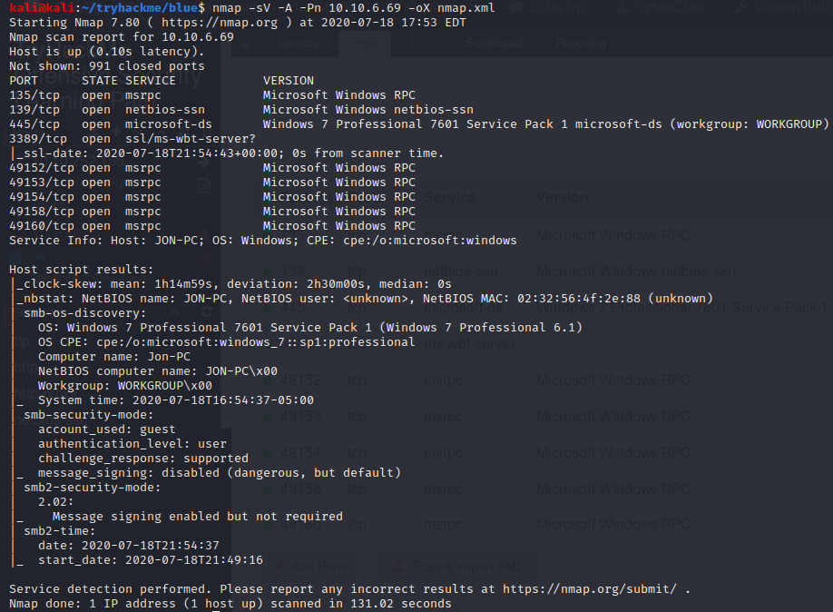

The host appears to use SMBv1. We can take advantage of more specific Nmap scripts to scan for vulnerabilities related to SMB using the option *--script=smb-vuln-\**.
 
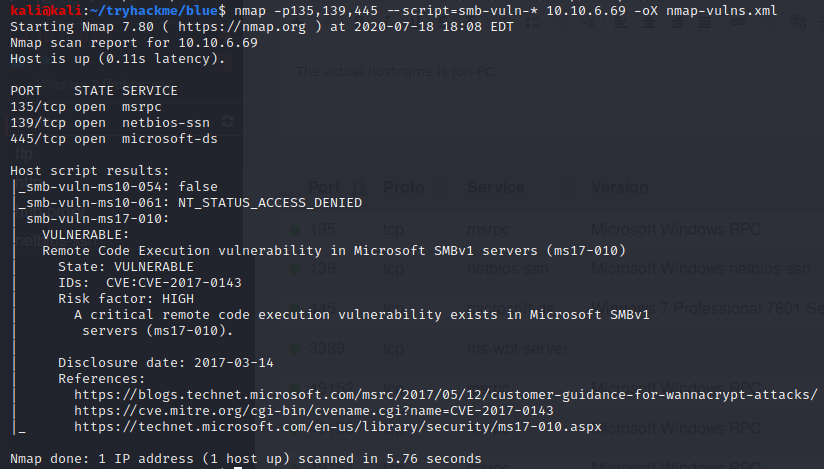

The scripts determine that the host is vulnerable to MS17-10, also known as EternalBlue. This exploit will allow us to execute arbitrary code on the SMBv1 server. We search for an exploit on Exploit-DB.

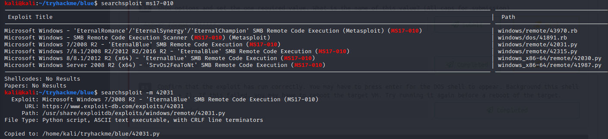

Exploit 42031 by worawit seems like a good fit. The exploit comments tell us to download and assemble generic x64 kernel shellcode, assemble it with nasm, and combine it with our own tailored payload.

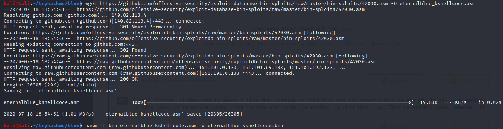

We use msfvenom to generate our reverse shell payload and concatonate the kernel shellcode and payload into a single binary. Msfvenom is part of the Metasploit Framework suite of pentesting tools that is used for generating custom payloads. We select a reverse shell payload suitable for a 64-bit Windows victim using *-p windows/x64/shell\_reverse\_tcp*. We specify our attacker IP address as the LHOST and port 443 as the LPORT. We generate the binary payload using *-f raw -o payload.bin*.

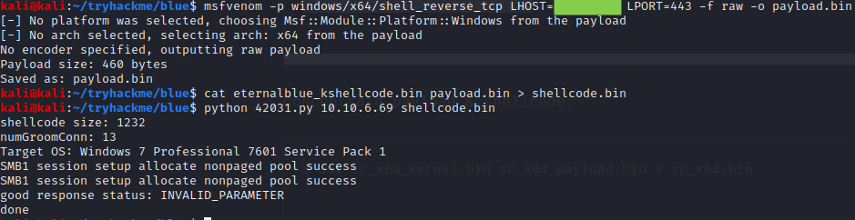

We start a netcat listener in another terminal and run the exploit. (The exploit script may need to be run a few times before it is successful.)

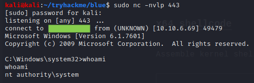

We see that the exploit was successful, and we have gained system privileges. Further privilege escalation is not necessary. We create a new administrative user with the following Windows commands and log on to RDP for further enumeration of the host.

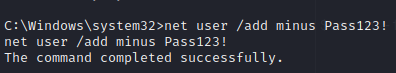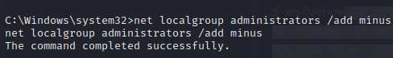

On command line: "xfreerdp /u:minus /p:Pass123! /v:10.10.6.69 +clipboard"

We download mimikatz.exe from our attacker web server using Windows Internet Explorer on the victim. Mimikatz is a post-exploitation tool for Windows that has many options for extracting passwords, password hashes, Kerberos tickets, and other sensitive information from the victim. We run mimikatz as administrator and use the commands "privilege::debug" and "sekurlsa::msv" to dump user hashes.

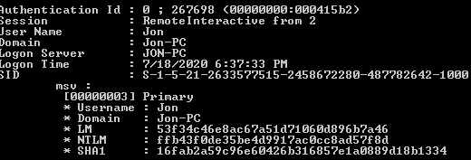

We find hashes for an administrative user named Jon. We are able to crack Jon's hashed password using a crackstation.net rainbow table.

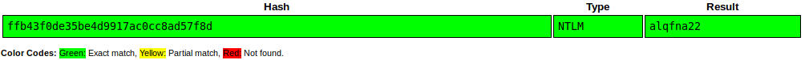

Jon's password is alqfna22. Since jon is an administrator, we no longer need our fake "minus" adminstrator account. We may delete minus and continue enumerating the host as jon. We find several flags on the host machine.

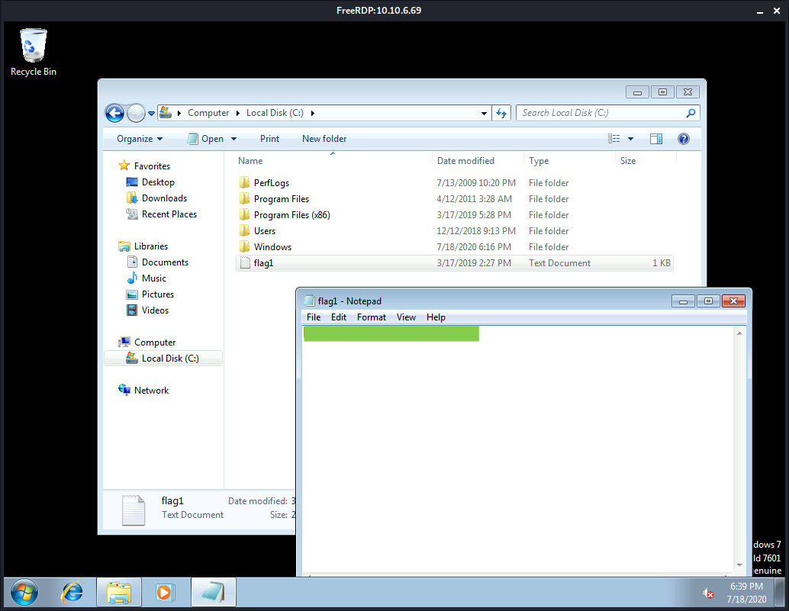

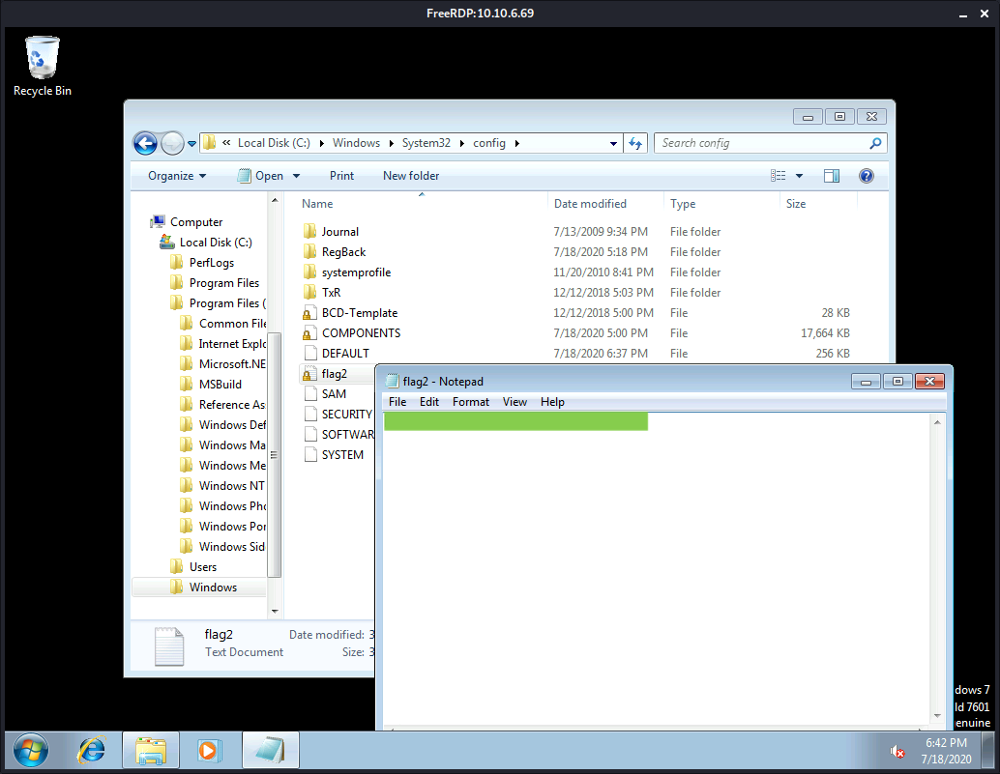

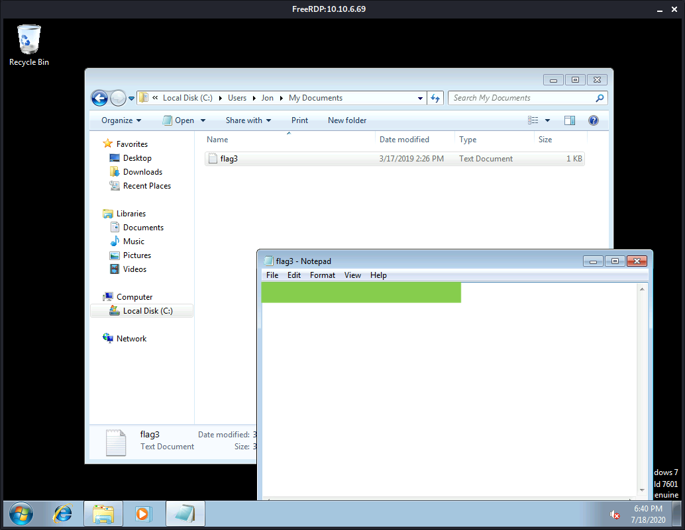