# Brainpan 1

## Summary

**Vulnerability Exploited:** Buffer Overflow Vulnerability in Brainpan.exe

**Vulnerability Explanation:** Brainpan.exe accepts passwords over the network. Brainpan does not properly handle unexpectedly long input, so an attacker can crash the program by submitting a very long password. With a specially crafted password, an attacker can take over program execution and execute arbitrary code on the system.

**Privilege Escalation Vulnerability:** The user Puck can execute "sudo /home/anansi/bin/anansi\_util" without a password. This binary can execute man, and a root shell can be obtained inside man with "!/bin/bash".

**Vulnerability Fix:** It is not possible to close the buffer overflow vulnerability in brainpan.exe without either rewriting the source code or recompiling the executable with stronger memory safety features such as Rebase and ASLR.

## Penetration

We begin as usual with a port scan using nmap.

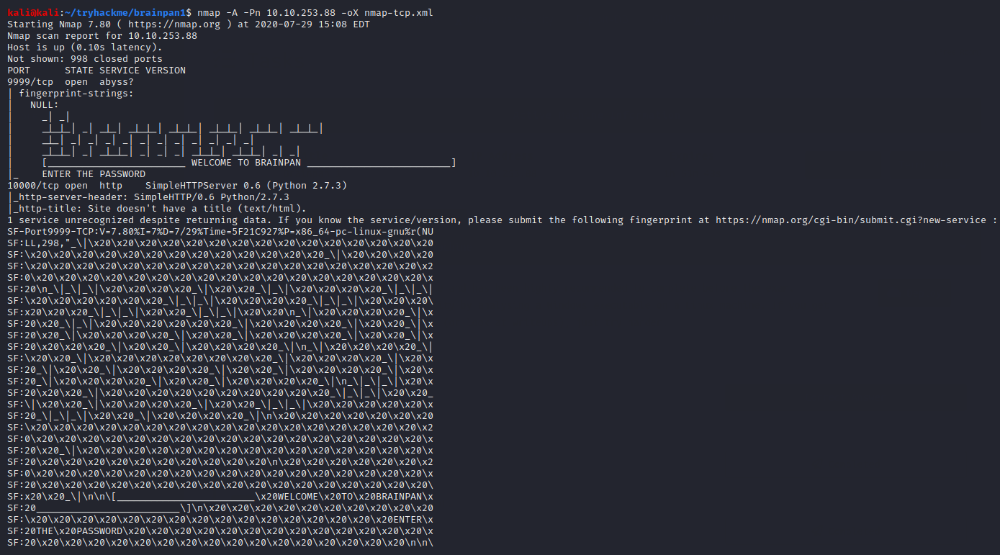

We find a strange service running on port 9999 and a python Simple HTTP Server on port 10000. We can investigate the unusual service with netcat.

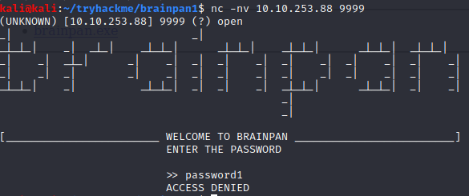

The service accepts user input, so we see another possible buffer overflow vulnerability. As usual, we need to find our own copy of the binary to reverse engineer.

We turn our attention to the web server on port 10000.

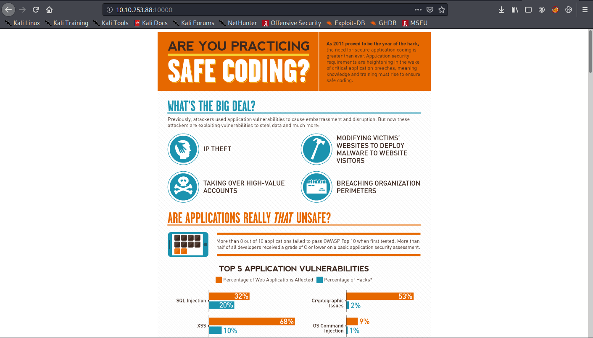

We find a helpful reminder to practice secure coding. Using gobuster, we find an even more helpful listable directory, /bin.

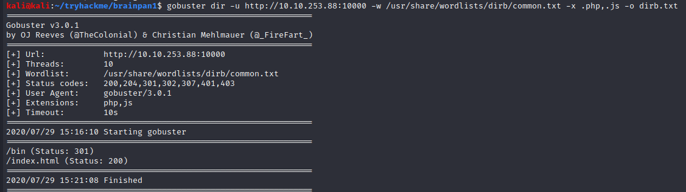

Inside the directory, we find the copy of the executable we need.

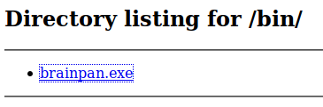

We now proceed to write a buffer overflow exploit bp-overflow.py in much the same manner as in Gatekeeper and Brainstorm using a Windows 10 lab machine with Immunity Debugger. As in those cases, we shall see that the exploit turns out to be the most trivial possible.

We start out by sending 3000 "A"s ("0x41") as our password.

This is more than sufficient to crash the program and overwrite EIP.

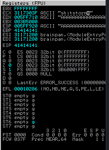

We can also see the _actual_ password, "shitstorm", spelled out in plaintext in the ECX register. Unfortunately, using this password doesn't seem to achieve anything.

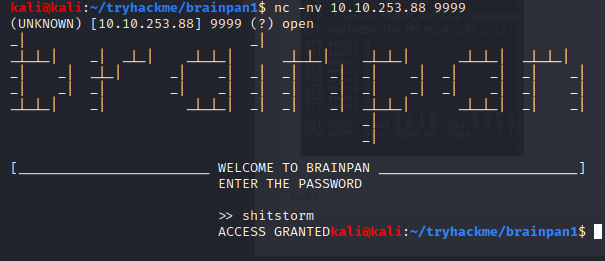

Moving right along with our buffer overflow exploit, we need to find the exact offset of EIP in our evil buffer. We can use msf-pattern_create for this purpose.

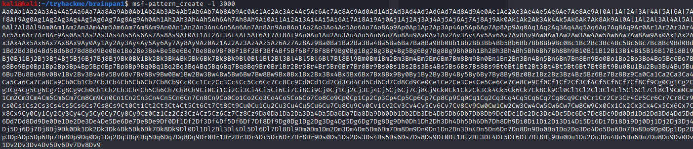

We replace the buffer in our exploit with the pattern.

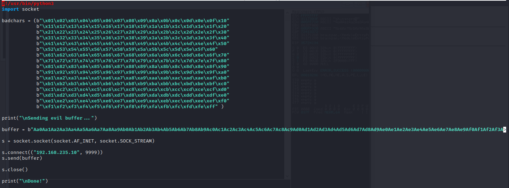

The updated exploit overwrites EIP with "0x35724134".

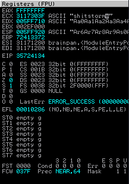

Msf-pattern_offset finds this substring at position 524 in the pattern.

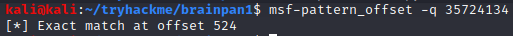

We confirm that this is the correct offset to overwrite EIP by updating our buffer to contain 524 "A"s, 4 "B"s ("0x42"), and 500 "C"s ("0x43").

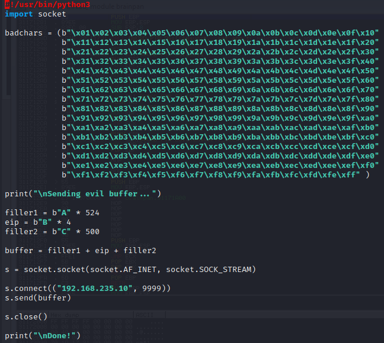

As expected, EIP is overwritten with "0x42424242".

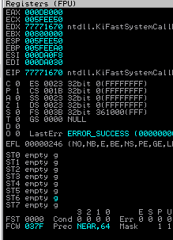

Next, we test for bad chars in the usual way. However, we find none (except "0x00", which we assume is a bad char).

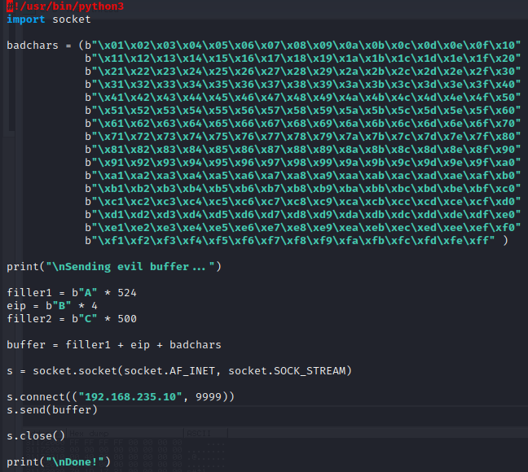

Next, we need to look for a JMP ESP instruction using "!mona modules" in Immunity.

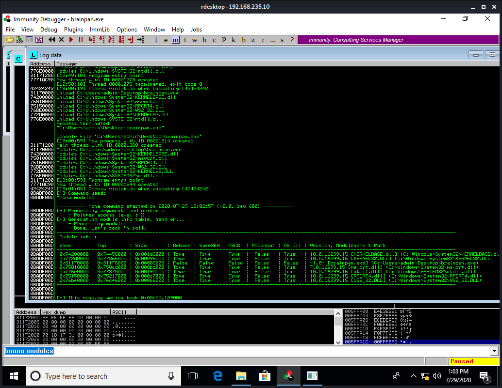

The only usable module (without Rebase, ASLR, etc) is brainpan.exe itself. Next, we search for JMP ESP (0xffe4) using "!mona find -s '\xff\xe4' -m 'brainpan.exe'".

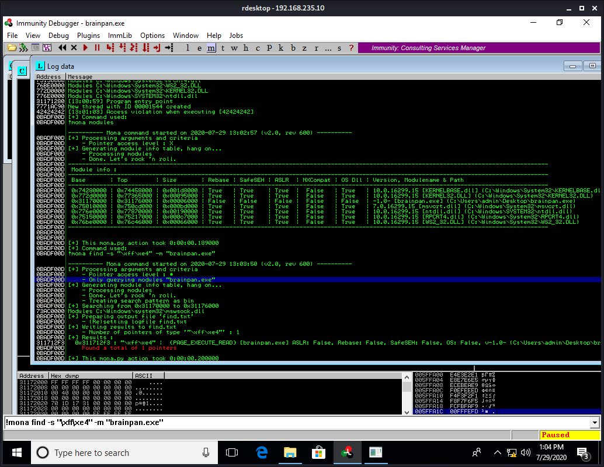

Mona finds the pointer 0x311712f3\. We will overwrite EIP with this address (as b"\xf2\x12\x17\x31", due to endianness) in our exploit.

Finally, we generate our shellcode using msfvenom.

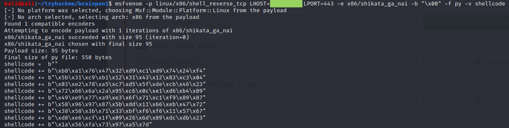

[Note: In this case, we know that the underlying OS is actually Linux just because Brainpan 1's flavortext says this is so. Without this hint, we would probably have to figure out that the host was running Linux through trial and error. The only hint intrinsic to the host that I noticed at this point in the engagement is that the web server is python, which ships with most Linux distros. However, since it's easy to install python on Windows, and the vulnerable binary is a Windows executable, I certainly would have assumed the host was running Windows but for the flavortext.]

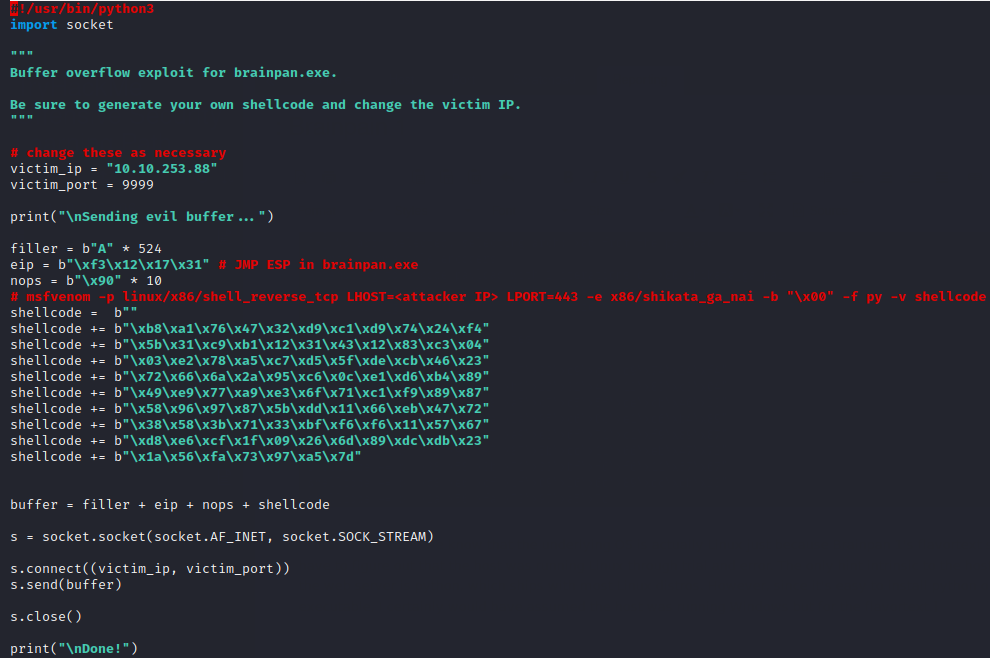

With this exploit, we are able to gain a low-privilege shell on the victim as the user Puck.

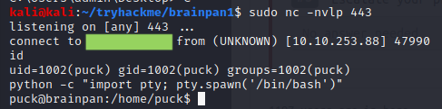

Note the use of **python -c "import pty; pty.spawn('/bin/bash')"** to upgrade our shell to a rudimentary terminal. This command is almost always helpful when catching a reverse shell from a Linux victim, but in this case it will turn out to be necessary for privilege escalation.

Speaking of privilege escalation, we start by looking for auto-elevating binaries.

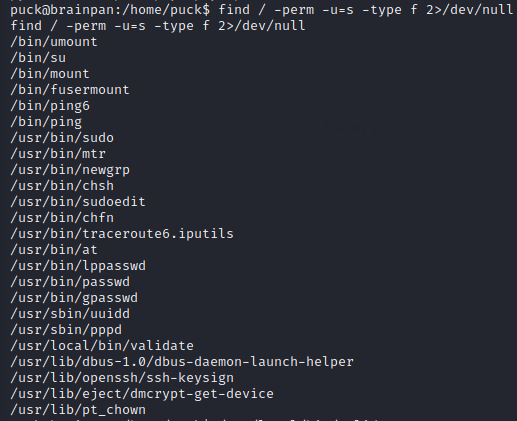

The binary /usr/local/bin/validate is unusual and almost certainly a vector for privilege escalation. But before we commit to this avenue, let's enumerate a little further. What commands can Puck sudo?

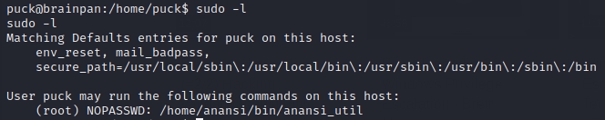

Puck can run **sudo /home/anansi/bin/anansi\_util** with no password. (That's good, since we don't know Puck's password. No, it's not "shitstorm".) But what exactly does anansi\_util do?

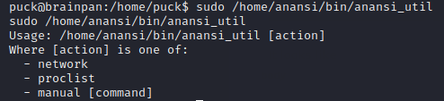

It looks like we can use **sudo anansi\_util** to effectively execute **sudo man** without a password. We can get a shell inside the man terminal using **!/bin/bash**. (Recall that the python pty terminal was necessary; the man terminal won't work correctly without it.) This is the privilege escalation vector we've been looking for.

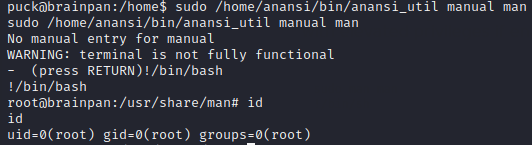

Now we are root and have total access to and control of the victim.

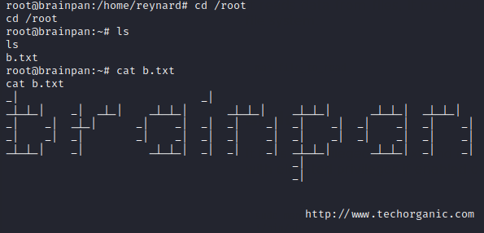