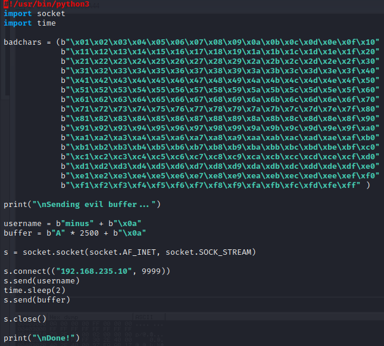

# Brainstorm

## Summary

**Vulnerability Exploited:** Buffer Overflow in Chatserver.exe

**Vulnerability Explanation:** Chatserver takes input from the network on port 9999\. Very long input can overwrite the program stack, causing the program to crash. An attacker can execute arbitrary code on the system with specially crafted input.

**Privilege Escalation Vulnerability:** None needed.

**Vulnerability Fix:** The vulnerability in chatserver cannot be fixed without rewriting the source code or recompiling it with memory safety features such as ASLR.

## Penetration

We begin as usual with a port scan of the target.

We find an unusual application running on port 9999. We can investigate it more closely with netcat.

The application is a rudimentary chat program that takes user input and echoes it. This kind of program is a prime candidate for a buffer overflow exploit. However, we will need our own copy of the program to reverse engineer in order to write our exploit. The only place to look for that copy is on the FTP server.
Luckily, anonymous access is allowed, so we can get everything we need without the trouble of finding credentials first. (Note that we need to change the data mode to binary with the bin command.)

Now that we have a copy of chatserver.exe and essfunc.dll, we can begin writing our buffer overflow exploit bs-overflow.py. As with Gatekeeper, we will use a Windows 10 lab machine with Immunity debugger for reverse engineering. In our first test, we confirm that we can actually crash the program with a string of 2500 "A"s. Note that we must first submit a username and wait briefly before submiting our buffer, and both the username and buffer should be delimited by a linefeed character ("0x0a").

After running the exploit, we see in Immunity that the chatserver has crashed and EIP has been overwritten with "A"s ("0x41").

Now we need to find exactly what part of our oversized buffer overwrites EIP. To do this, we will use a pattern generated by msf-pattern_create as our buffer.

This time we find that EIP has been overwritten with "0x31704330".

We find the offset of this substring in our pattern using msf-pattern_offset.

We find that the offset is 2012 bytes. We confirm this by rewriting our buffer to consist of 2012 "A"s, 4 "B"s, and 484 "C"s. This should overwrite EIP with "0x42424242".

We see the expected result in Immunity.

To finish our exploit, we need to overwrite EIP with the address of a useful assembly instruction, and we need to generate a payload. Since ESP points directly to the beginning of our long string of "C"s, we can point EIP to a JMP ESP instruction and replace the "C"s with our shellcode.

Before we can select the overwrite address or generate the shellcode, we need to identify bad chars that will end our input string prematurely. We suppose "0x00" and "0x0a" will be bad chars, since the null char often delimits strings, and linefeed ends input to the chat program. We can test for bad chars in the same way we previously did for Gatekeeper, using a long string of every possible character in place of the "C"s.

We find that "0x00" and "0x0a" are indeed the only bad chars.

We now use the the command "!mona modules" in Immunity to find all modules loaded with chatserver.exe. We must find our JMP ESP instruction in one of these modules.

We find only chatserver.exe itself and essfunc.dll are compiled without memory safety features like Rebase and ASLR, so our simple buffer overflow exploit must use one of these. However, the base address of chatserver.exe starts with "0x00", one of our bad chars, so no address in this module will be suitable for overwriting EIP. Thus essfunc.dll is our only choice.

We can find the address of a JMP ESP instruction (0xffe4) in essfunc.dll using "!mona find -s '\xff\xe4' -m 'essfunc.dll'".

Mona finds 9 pointers. We will use 0x625014df to overwrite EIP (remembering to write the bytes in reverse order in our code due to little endianness).

Finally, we generate our shellcode using msfvenom.

With that, our exploit is complete. (Note the NOP sled at the start of the payload before the shellcode.)

We run the exploit against the target machine.

We find that the chatserver application was running with very high privileges, and so our buffer overflow exploit has earned us a full system shell. No further privilege escalation is necessary.

