# Daily Bugle
## Summary

**Vulnerability Exploited:** Joomla! CMS 3.7.0 'com_fields' SQL Injection (CVE-2017-8917)

**Vulnerability Explanation:** Attackers can access sensitive information from the server database through Joomla! using a specially crafted URI.

**Privilege Escalation Vulnerability:** Sudo yum with a custom plugin.

**Vulnerability Fix:** Update to the latest version of Joomla! CMS.

## Penetration

We begin with a port scan of the target host using nmap.

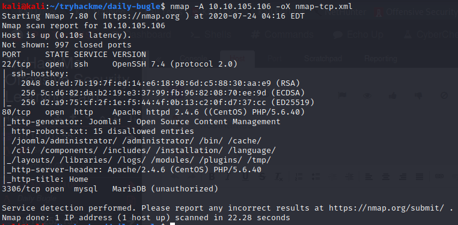

We investigate the web server on port 80, since this is the softest target.

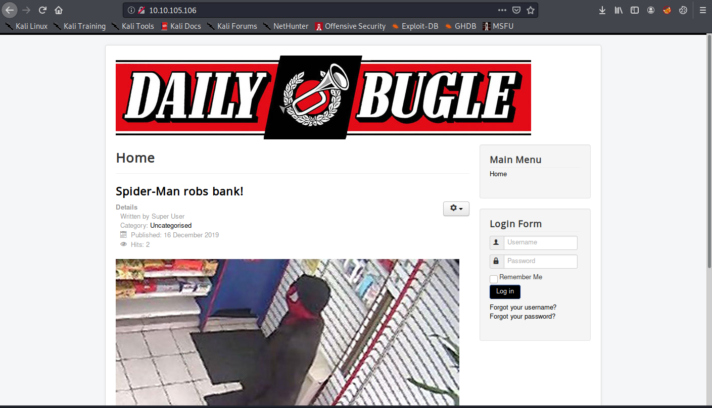

The robots.txt lists several interesting internal directories, including /administrator.

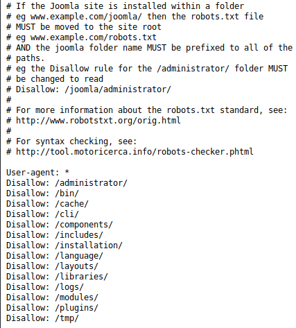

At /administrator, we find a Joomla! CMS admin console. By navigating to http://\<victim ip\>/administrator/manifests/files/joomla.xml, we find that the version is 3.7.0\. This version is vulnerable to SQL injection. We are able to exploit this vulnerability using the public joomblah exploit from Xiphos (https://github.com/XiphosResearch/exploits/blob/master/Joomblah/joomblah.py).

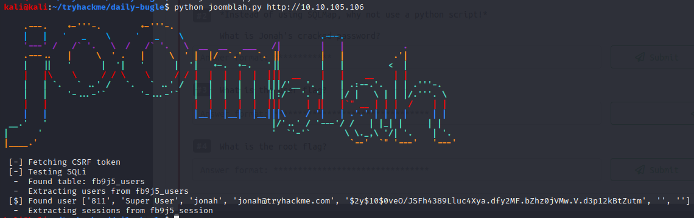

Joomblah finds a hashed password for the Joomlah! super user jonah. John the Ripper cracks the hash as "spiderman123". With this, we can access the admin console.

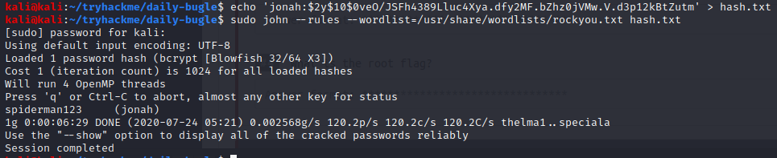

In the admin console, we upload Pentest Monkey's php reverse shell by editing the /index.php file of the protostar template.

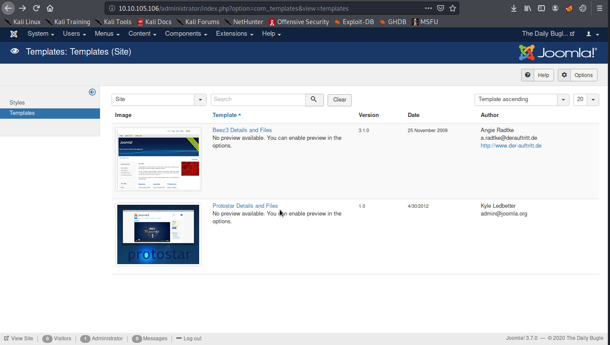

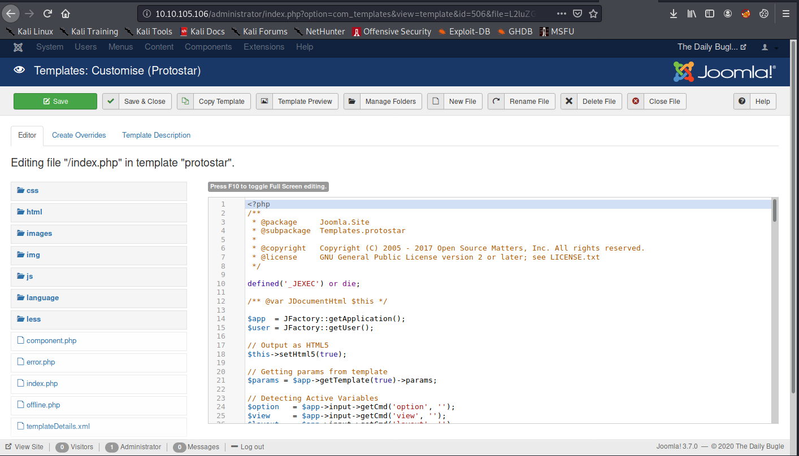

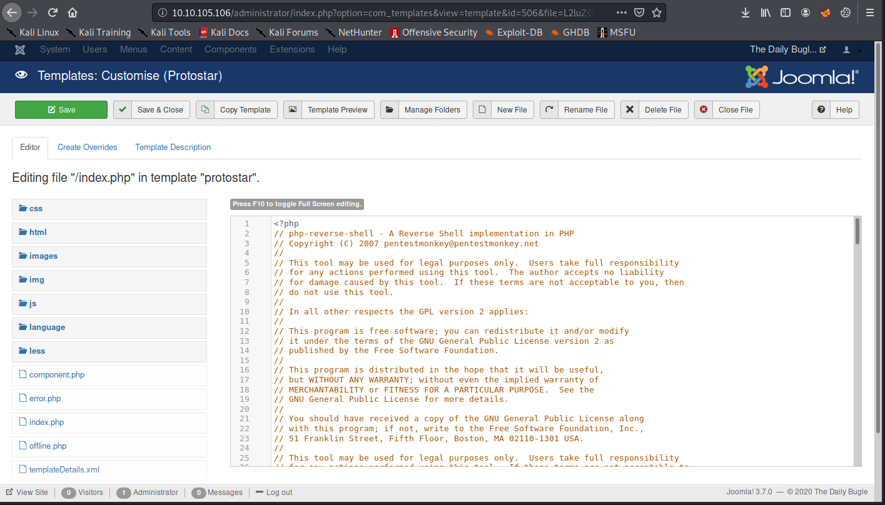

We launch the shell by navigating back to the homepage and catch it with a netcat listener on our attack machine.

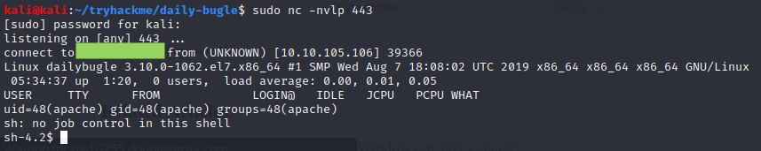

We now begin looking for ways to elevate our privileges. In the /var/www/html/configuration.php file, we find a root password for mysql. As it turns out, this password can also be used for ssh as the user jjameson.

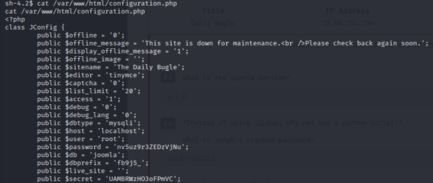

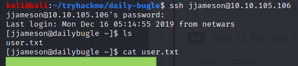

As jjameson, we find we have the privelege to execute "sudo yum" with no password.

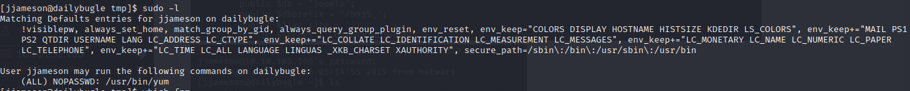

This allows us to elevate our privileges using a custom plugin. The method is explained on GTFOBins (https://gtfobins.github.io/gtfobins/yum/).

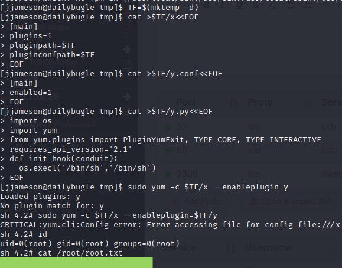

At this point, we have full control of the server.