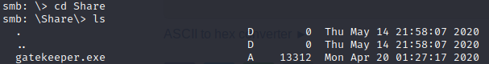
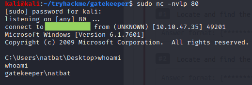
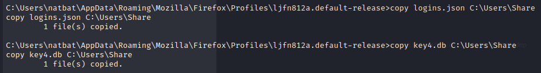

# Gatekeeper

## Summary

**Vulnerability Exploited:** Buffer Overflow in Gatekeeper.exe

**Vulnerability Explanation:** The custom executable gatekeeper.exe accepts user input from the network. Due to unsafe handling of this user input, it is possible to take over program execution and ultimately execute arbitrary code by sending a very long, specially crafted input.

**Privilege Escalation Vulnerability:** Passwords saved in Mozilla Firefox App Data

**Vulnerability Fix:** It is not possible to fix vulnerability in gatekeeper.exe without rewriting the source code or recomiling the executable with better safety features. To better protect Firefox saved passwords, consider using a master password.

## Penetration

We begin with a port scan of the target using nmap.

We see that something interesting is running on the (punny) port 31337. We can investigate it a little more closely using netcat.

We see that the program takes user input "<X>" delimited by a linefeed character and responds with "Hello <X>!!!". This application seems verly likely to suffer from a buffer overflow vulnerability, but we won't be able to develop an exploit without a copy of the executable.

The only other obvious place to look is SMB on port 445.

We find that we can access the \User share without a password. We find the executable we need to reverse engineer in the Share folder.

(Not pictured: "get gatekeeper.exe".)

We can now begin developing our buffer overflow exploit. In order to do this, we need a windows client with a debugger to run gatekeeper.exe on. I have a Windows 10 lab machine running Immunity Debugger for this purpose. (The target machine is Windows 7 SP 1 instead of Windows 10, but as we shall see the buffer overlow exploit we write will also work on the target. In some situations, an exploit may not be so portable.) We upload gatekeeper.exe to our lab machine, launch the executable, and attach the resulting process to our debugger.

We will develop our exploit in python 3 as gk-overflow.py. For our first test, we try sending a long enough string of "A"s to crash the gatekeeper program. Recall that we need to end the buffer with a linefeed character "\x0a". If we forget the linefeed, our buffer won't crash the program.

We make the python script executable with "chmod +x gk-overflow.py" and run it with "./gk-overflow.py".

On our debugger, we see that we have overwritten EIP with "A"s (hexadecimal "\x41"), so we now know we can cause a buffer overflow with just 201 bytes of input.

Next, we need to find out which part of our oversized buffer overwrites EIP. We can do this by using a special buffer created using the msf-pattern_create tool.

We replace the 200 "A"s in our buffer with the 200-byte pattern we generated.

We restart the debugger and run the updated exploit.

EIP is now overwritten with 39654138. We find the offset with msf-pattern_offset.

The exact offset is at 146 bytes. We update our exploit again.

This new exploit should overwrite EIP with four "B"s (hexadecimal "\x42"). We reset the debugger and rerun the exploit.

Now we need to get our overflow to do something useful. ESP points to the beginning of our long string of "C"s (hexadecimal "\x43"). We can overwrite EIP wth a JMP ESP instruction and replace the string of "C"s with a NOP sled (hexadecimal "\x90") and our shellcode. Note that we only have 50 bytes in our 201-byte buffer for the shellcode, and shellcode is usually a few hundred bytes long. Sometimes increasing the length of the buffer this dramatically will require us to fundamentally change the structure or our exploit, but thankfully that is not the case here.

In order to find a suitable JMP ESP instruction and write our shellcode, we first need to eliminate "bad chars", bytes that will cut our buffer short if they are included. The null byte "\x00" is almost always a bad char, and in this case we should expect the linefeed character to be a bad char, since it delimits the end of our buffer. To test for bad chars we replace the string of "C"s in our exploit buffer with our string of all bytes from "\x01" to "\xff".

We run the exploit again and check the stack in our debugger. If we have a bad char in our buffer, the first bad char and all characters after it will not appear on the stack.

As expected, the pattern on the stack ends after "\x09", indicating that the linefeed "\x0a" is a bad char. We can continue testing for bad chars by removing "\x0a" from the badchars bytes object in our code and running the exploit again. We would repeat this process until every byte remaining in badchars shows up in the stack. However, in this case, "\x00" and "\x0a" are the only bad chars, so we can stop here.

We can generate our shellcode using msfvenom.

We can add this shellcode (and a short NOP sled) to the end of our exploit buffer.

Now we need to find a JMP ESP instruction to point EIP toward. We can do this with using mona, a python-based command module for Immunity. With the command "!mona modules", we can view all modules loaded with the gatekeeper.exe program.

We see that in addition to gatekeeper.exe itself, several DLLs have been loaded. Only gatekeeper.exe is suitable for our purposes, since we see that it is the only module that hasn't been compiled with memory safety features such as Rebase and ASLR, which would make writing the exploit much more difficult.

We can search for a JMP ESP ("\xff\xe4" in hex) instruction in gatekeeper.exe using the command "!mona find -s '\xff\xe4' -m 'gatekeeper.exe'".

Mona finds two suitable pointers. We replace the four "B"s in our exploit code with this address. Note that we need to write the bytes in reverse ("little endian") order in our exploit.

Our exploit is now complete. This time, we can run it against the target machine to get a shell.

We can often get a system shell with these kinds of buffer exploits, but unfortunately in this case we got a low-privilege shell as the natbat user.

Now we need to elevate our privileges. We can use the winPEAS tool (https://github.com/carlospolop/privilege-escalation-awesome-scripts-suite) to automate the enumeration process for us.

We find that the host is pretty well locked down, but winPEAS finds some interesting files that may contain passwords.

Natbat has some passwords saved in Mozilla Firefox. We can exfiltrate the key4.db and logins.json files from her Firefox profile through the SMB share.

[A CTF Note: In this case, the fact that natbat has a link to Firefox and little else on her desktop is a pretty big hint that Firefox saved passwords is the right privilege escalation vector. Additionally, the flavortext for this room mentions that we will find "fire" after bypassing the gatekeeper.]

Now that we have the credential files, we need to crack them somehow. There are several tools available on github to do this; we went with firepwd (https://github.com/lclevy/firepwd). We clone the repository, install its requirements with pip, and run "python3 firepwd.py -d <directory with credential files>". Firepwd finds a set of credentials for the mayor, a local administrator.

Luckily for us, this password is also the mayor's account password, so we can use it for RDP. As the mayor, we have full administrative conrol of the machine.

