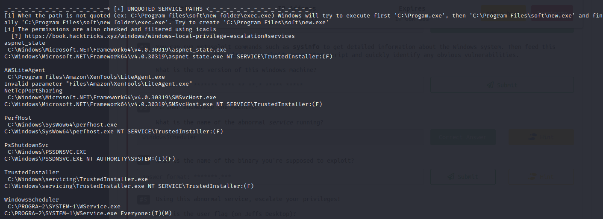

# Hackpark
## Summary

**Vulnerability Exploited:** BlogEngine.NET 3.3.6 Directory Traversal and Remote Code Execution (CVE-2019-6714).

**Vulnerability Explanation:** BlogEngine.NET has a vulnerability which allows authenticated users to upload malicious files and use them to execute arbitrary code on the system.

**Privilege Escalation:**Splinterware System Scheduler Pro 5.12 - World-Writable Installation Directory

**Vulnerability Fix:** Upgrate to the latest version of BlogEngine.NET. Use a stronger password for the BlogEngine.NET administrative account. Change the privileges of the System Scheduler installation directory so that only administrative/system users can modify its contents.

## Penetration

We begin with an nmap scan of the target host.

The only real point of entry is the web server.

We find a BlogEngine.NET blog. The admin console is linked directly from the homepage.

The default credentials admin:admin do not succeed. Thus we will attempt to brute force the login with hydra, a tool for automated password brute forcing. We guess that the user will be admin and use the rockyou wordlist for candidate passwords. To bruteforce an http-form-post password, we need give the path to the form. We also need extract all the form parameters. This can be done with BurpSuite or Firefox's native Web developer tools. (Web Developer \> Network \> click the form submission with "edit and resend". The parameters can be extracted from the request body.) We also need to supply a success or failure criterion for login attempts. In this case, failed login attempts result in the text "Login failed" appearing on the page. This is all the information we need to launch our brute force attack. The command looks quite complicated, but most of it is just copy/pasted directly from the form params, with ^USER^ and ^PASS^ indicating where hydra should insert "admin" and the rockyou passwords into its requests.

Hydra cracks the credentials as admin:1qaz2wsx. We login to the console.

We find that the BlogEngine.NET version is 3.3.6.0. We search Exlpoit-DB to find public exploits for this software.

We find that BlogEngine.NET has a well-known remote code execution vulnerability CVE-2019-6714 which we can exploit with EDB-46353. The exploit gives the following instructions.

    /*
     * CVE-2019-6714
     *
     * Path traversal vulnerability leading to remote code execution.  This
     * vulnerability affects BlogEngine.NET versions 3.3.6 and below.  This
     * is caused by an unchecked "theme" parameter that is used to override
     * the default theme for rendering blog pages.  The vulnerable code can
     * be seen in this file:
     *
     * /Custom/Controls/PostList.ascx.cs
     *
     * Attack:
     *
     * First, we set the TcpClient address and port within the method below to
     * our attack host, who has a reverse tcp listener waiting for a connection.
     * Next, we upload this file through the file manager.  In the current (3.3.6)
     * version of BlogEngine, this is done by editing a post and clicking on the
     * icon that looks like an open file in the toolbar.  Note that this file must
     * be uploaded as PostView.ascx. Once uploaded, the file will be in the
     * /App_Data/files directory off of the document root. The admin page that
     * allows upload is:
     *
     * http://10.10.10.10/admin/app/editor/editpost.cshtml
     *
     *
     * Finally, the vulnerability is triggered by accessing the base URL for the
     * blog with a theme override specified like so:
     *
     * http://10.10.10.10/?theme=../../App_Data/files
     *
     */

We follow the instructions and upload our malicious PostView.ascx file to the only post on the blog.

We navigate to http://\<victim ip\>/?theme=../../App_Data/files to launch the shell.

We now have a foothold on the system. Our current shell is not very stable, but we can easily upgrade it with a malicious executable created with msfvenom.

We can download shell.exe using PowerShell, which is installed by default on most Windows systems.

We can now begin looking for ways to elevate our privileges. We use the publicly available winPEAS.bat script to automate enumeration of the host. This script can also be downloaded with PowerShell as we did with shell.exe.

WinPEAS.bat finds that the service WindowsScheduler has an installation directory which is modifiable by everyone.

It turns out this is a known vulnerability with the default installation of System SCheduler Pro 5.12\. We can exploit this vulnerability by replacing the WService.exe binary with a malicious version created by msfvenom.

Now we should just be able to wait for the service to run with high privileges and catch it on another listener on our attacker machine. However, the shell does not come as expected. We investigate further into the installation directory to find out why the exploit is not working as expected. We find a logfile showing that the binary being run on a schedule is not actually WService.exe but Message.exe.

We can make our exploit work simply by renaming the malicious WService.exe as Message.exe.

Finally, we just wait about 30 seconds to catch the new shell as Administrator.

