# Kenobi
## Summary

**Vulnerabilities Exploited:**

1.  Sensitive Files on Insecure SAMBA Share.
2.  ProFTPd 1.3.5 Arbitrary File Copy Vulnerability (CVE-2019-12815)

**Vulnerability Descriptions:**

1.  The \\\<victim ip\>\anonymous share allows guest users with read and write privileges, yet it also contains a sensitive log file. Attackers can use the information in this log file, together with the following software vulnerability, to gain low-privilege access to the host.
2.  ProFTPd 1.3.5 has a flaw in its copy_mod module. Attackers can exploit this vulnerability to copy arbitrary files to arbitrary locations on the server, constrained only by the privileges of the FTPd user.

**Privilege Escalation Vulnerability:** The custom binary /usr/bin/menu runs with auto-elevated privileges, and it executes other binaries (in particular, curl) without declaring a full path. This allows attackers to create a malicious curl binary, execute it through the highly privileged /usr/bin/menu binary, and gain root privileges for themselves.

**Vulnerability Fix:** Consider restricting access and privileges for SAMBA and NFS shares. If a share must be accessible to guest users, its contents should be thoroughly audited to prevent the disclosure of sensitive information. Keep all software up to date; in particular, upgrade to the latest stable version of ProFTPd.

## Penetration

We begin with a port scan of the target host.

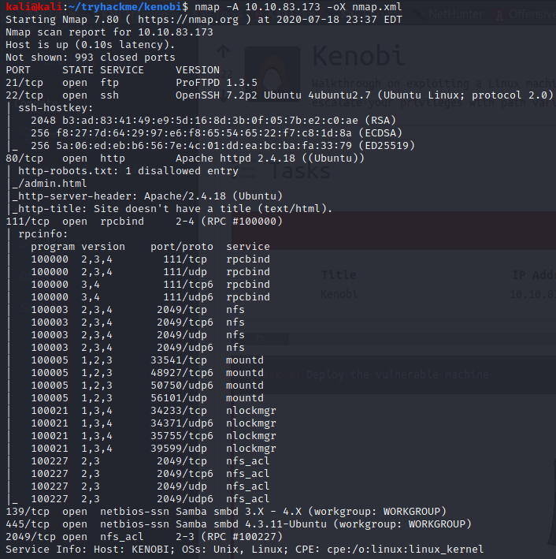

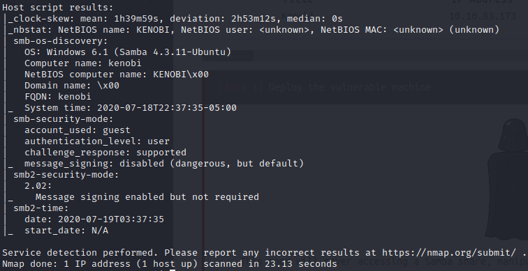

This host has a number of interesting ports open, including FTP on port 21, HTTP on port 80, SMB/SAMBA on port 445, and an NFS share on 2049. We can enumerate the target SAMBA share with the nmap script *smb-enum-shares.nse*. (We also run the *smb-enum-users.nse* script but receive no output.)

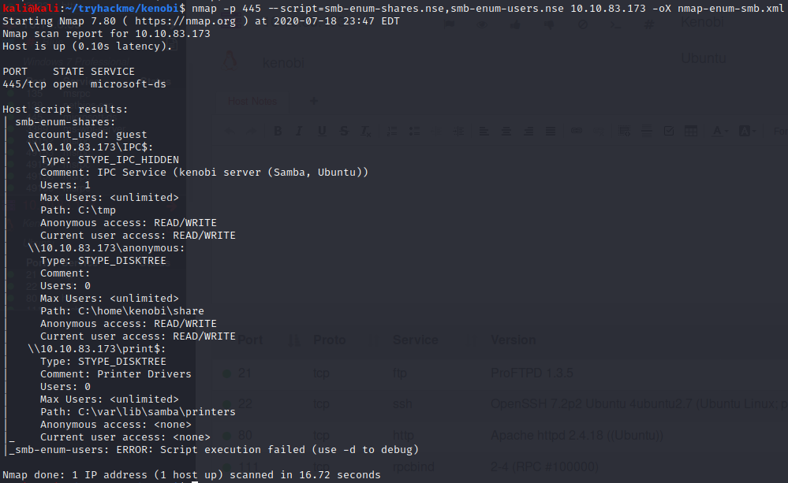

The anonymous share looks interesting, as it is not a default share and allows guest read/write access. We connect with smbclient, a standard Linux tool for collecting to SMB/SAMBA shares, to enumerate the files on the share.

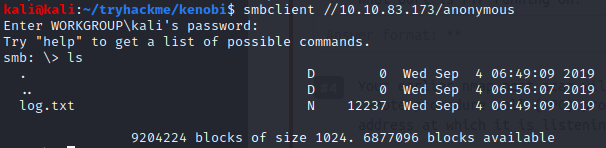

The log file might contain sensitive information, so we download it with smbget. The *-R* flag tells smbget to spider into internal folders and download files *recursively*.

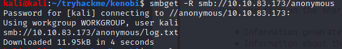

The log shows that the user kenobi has generated an RSA keypair stored at /home/kenobi/.ssh. It also contains the full configurations for ProFTPd and SAMBA. We learn that ProFTPd runs as the kenobi user.

We now turn our attention to the ProFTPd application. We use searchsploit to search for vulnerabilities associated with the version in use on the host.

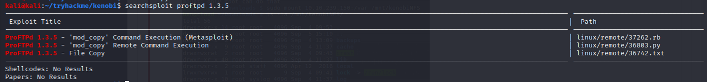

We find that ProFTPd 1.3.5 has an arbitrary file copy vulnerability (EDB 36742 / CVE-2019-12815). We can potentially exploit this vulnerability to copy kenobi's RSA key (the location of which is discolsed by log.txt) to a share from which we can exfiltrate it.

We enumerate NFS shares on the host with nmap using the script *nfs-showmount.nse*. (Again, we try a few extra scripts just in case but gain no intelligence from them.)

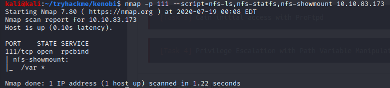

We use the ProFTPd 1.3.5 vulnerability to copy kenobi's private RSA key to a location in /var, the exportable directory. First, we connect to the ftp server using our multipurpose TCP/UDP socket tool netcat. We use the SITE CPFR to choose the file to copy and SITE CPTO to designate the designate the path to save the copy to.

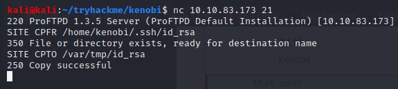

Next, we mount the exportable share to our attacker machine.

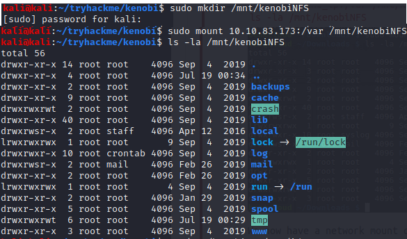

Finally, we exfiltrate the private key and use it to SSH into the host as the user kenobi. Note that we need to adjust the permissions of the key with chmod in order to use it for SHH.

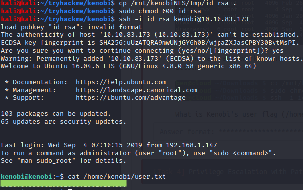

Now that we have a foothold on the victim host, we begin looking for ways to elevate our priviliges. We check for binaries with auto-elevating priviliges.

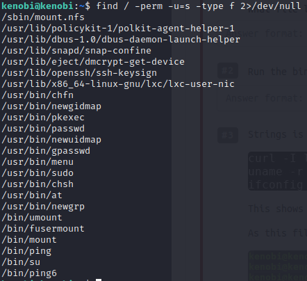

The binary /usr/bin/menu stands out as it is not a standard SUID binary. We see that running this binary gives a menu allowing us to perform one of three actions: status check, kernel version, or ifconfig. We further examine binary with the strings command, which allows us to view ASCII content within a binary file.

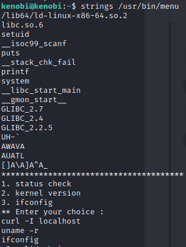

We see that /usr/bin/menu implements its three options by calling curl, uname, or ifconfig. Importantly, /usr/bin/menu does not declare the full path for binaries it calls. We can exploit this misconfiguration by creating our own malicious curl binary (in this case, a copy of /bin/bash) and changing our $PATH variable with the export command so that /usr/bin/menu will execute our malicious curl instead of the real one. Due to /usr/bin/menu's auto-elevating priviliges, this will spawn a root shell.

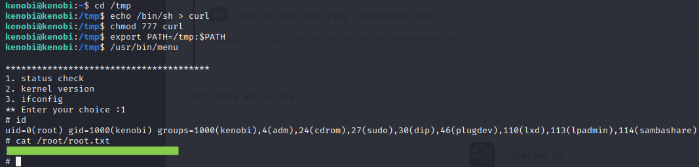