# Mr. Robot CTF

## Summary

**Vulnerability Exploited:** WordPress Brute Force Amplification

**Vulnerability Explanation:** Attackers can exploit a vulnerability in the XML-RPC multicall method in some installations of WordPress to more easily brute force passwords to administrative accounts. With administrative access to WordPress, an attacker can easily upload a webshell to gain a foothold on the victim server.

**Privilege Escalation Vulnerability:** Nmap SUID

**Vulnerability Fix:** Update to the most recent stable version of WordPress. Do not configure nmap to run with auto-elevating privileges without a strong operational justification.

## Penetration

We begin with a port scan of the target using nmap.

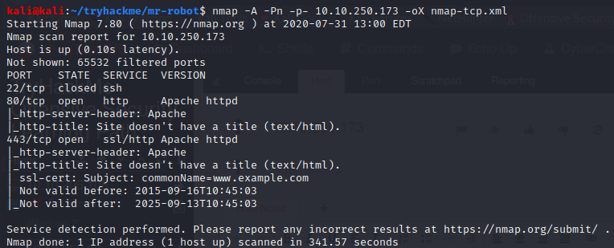

A cursory inspection suggests that there is little or no difference in content between the HTTP and HTTPS web servers, so we will focus on port 80.

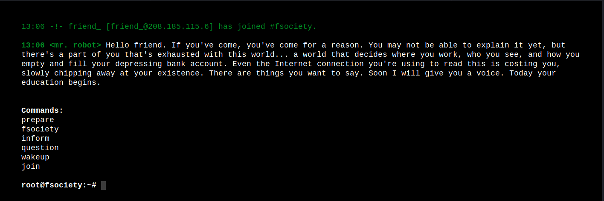

We find what appears to be an augmentated reality promotion for the USA TV series _Mr. Robot_. Running the commands just displays promo videos and images that do not appear to divulge any sensitive information. We will ignore them for now; we can inspect them more closely for clues later if we hit a wall. We check the site's robots.txt.

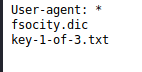

Robots points us to the first flag and what appears to be a wordlist generated by a tool like CeWL.

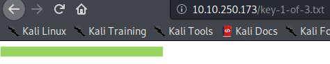

The wordlist is too long to be useful for many brute forcing applications (considering the lab is a CTF intended to be completed in under two hours). Thankfully it contains many duplicates. We can shorten it to a manageable size without losing any content using the linux sort command with the -u switch.

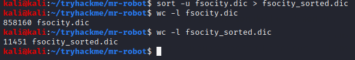

Now we need to find something to brute force with this wordlist. We further enumerate the web content using gobuster.

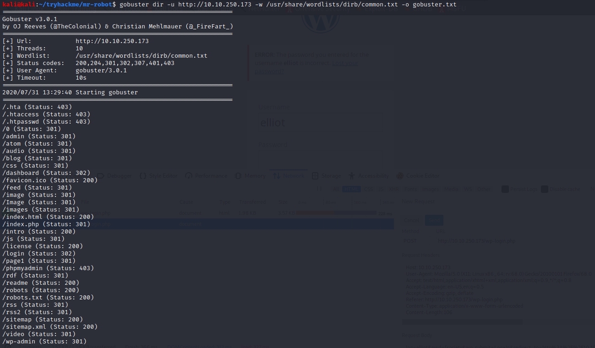

Gobuster has found a WordPress installation. We navigate to /wp-login.php and attempt to login with the credentials "admin:admin".

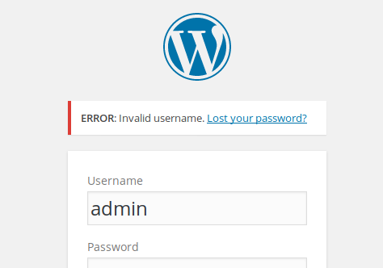

This does not work, but more importantly we see that "admin" is not a valid username. We try a handful of other names relevant to _Mr. Robot_ and find that "elliot" works.

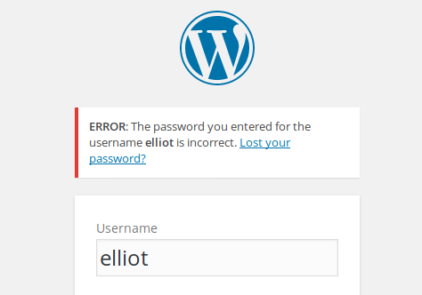

Now we will attempt to brute force Elliot's password. The easiest way to do this for a WordPress login is to use wpscan, an automated tool for finding common wordpress vulnerabilities. The syntax for brute forcing a WordPress login with wpscan is cleaner than with, say, hydra. Wpscan will also exploit a common WordPress XML-RPC multicall vulnerability to attempt many passwords at once, shortening the time required for brute force. Finally, wpscan will attempt to enumerate other vulnerabilities in the WordPress installation plugins and themes. [Note: Wpscan could also help us enumerate WordPress users if we hadn't already manually discovered Elliot.]

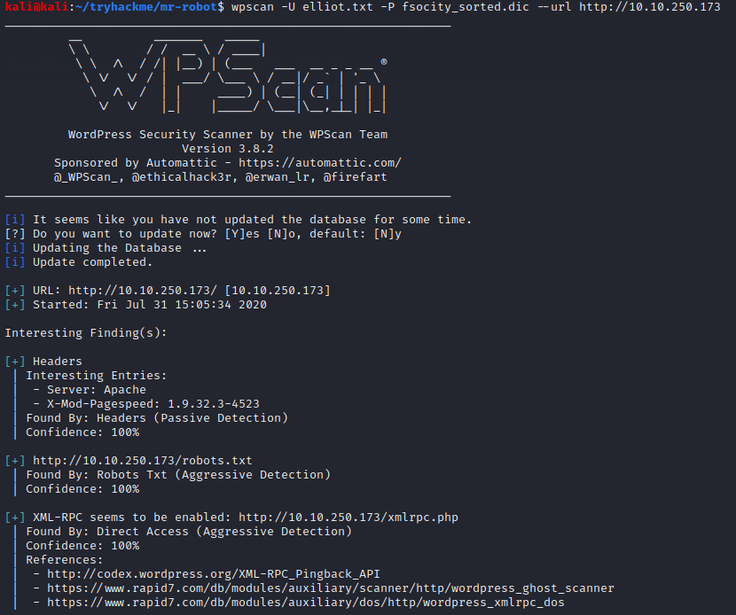

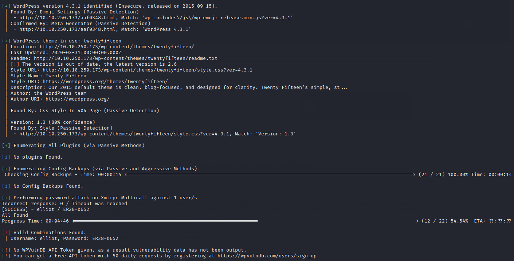

Wpscan brute forces Elliot's password as ER28-0652\. We log into the admin console.

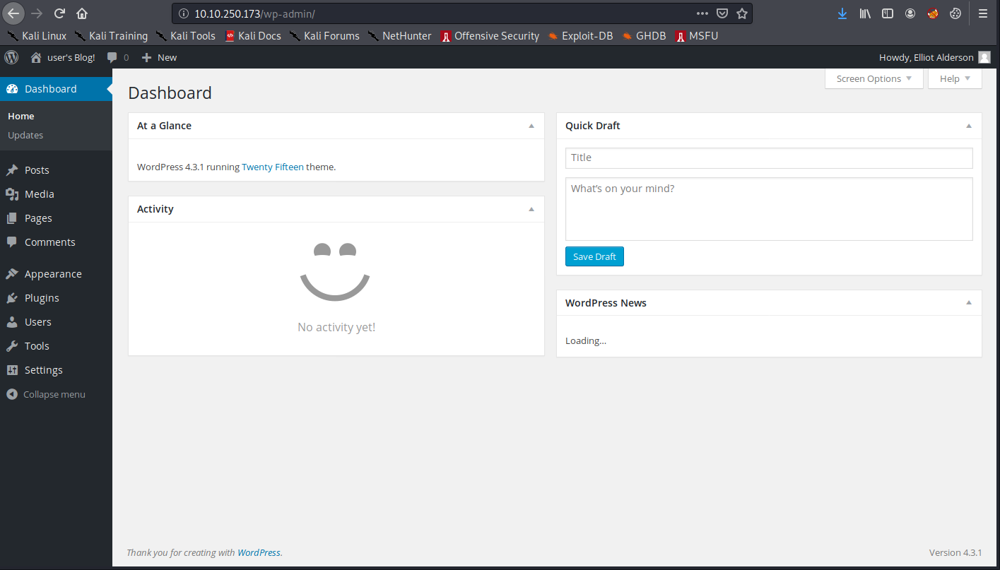

From here, we can upload a php web shell by editing the header.php file of the WordPress theme. (Click Appearance \> Editor from the left-hand panel, and then select header.php from the templates at right.)

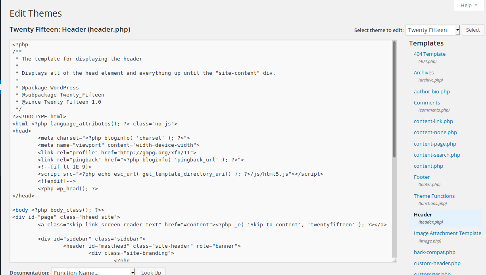

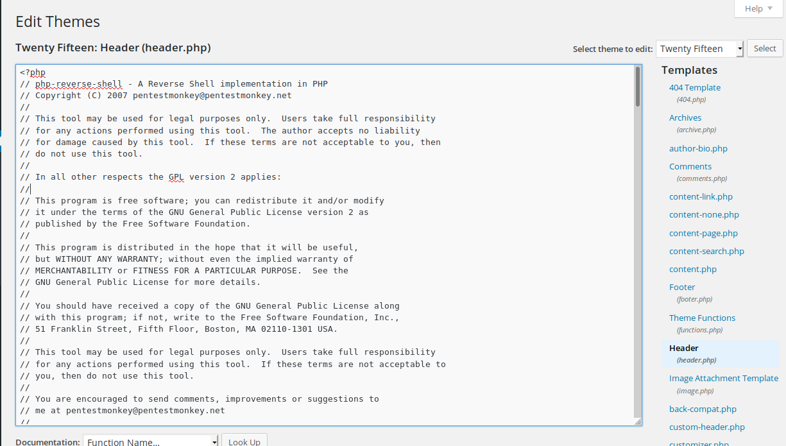

We launch the shell by navigating to /0 and catch it in a waiting netcat listener.

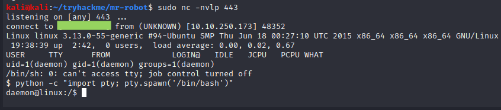

We find that we are the daemon user. We next investigate the /home folder to see if we can access files belonging to low-privilege users.

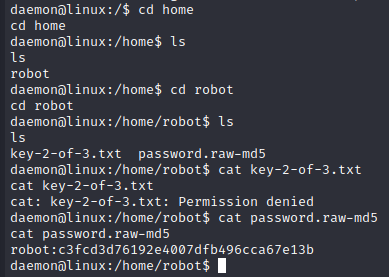

We find the hash of robot's password conveniently lying around. We can crack it near-instantly with Crackstation.net's online rainbow table.

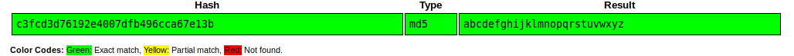

With this password, we can switch users from daemon to robot and read the second flag.

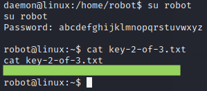

Unfortunately, robot is not a superuser, so we still need to escalate our privileges. We begin as usual by looking for auto-elevating binaries.

We see that nmap runs with root permissions. This misconfiguration allows us to launch a root shell from nmap in interactive mode.

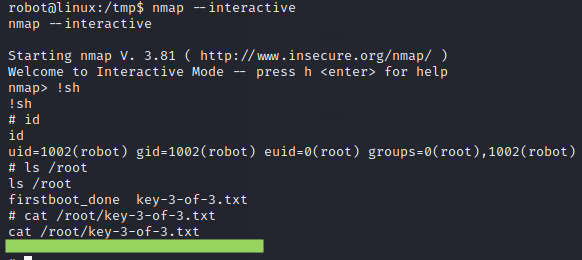

With that, we have captured the final flag.