# Steel Mountain

## Executive Summary

**Vulnerability Exploited:** Rejetto HTTP File Server 2.3 Remote Code Execution (CVE-2014-6287)

**Vulnerability Explanation:** HTTPFileServer allows attackers to execute arbitrary code on the server through a specially crafted request. This command execution can even be done through a browser, e.g. by navigating to http://\<victim ip\>:8080/?search=%00{.\<code to execute\>.}.

**Privilege Escalation Vulnerability:** IObit Advanced Systemcare 9 Unquoted Service Path

**Vulnerability Fix:** Upgrade to the latest version of HTTP File Server (2.3m). Audit service paths to ensure that they are quoted and that installation directories are not world-writable. 

## Methodology

We begin with a port scan of the target host.

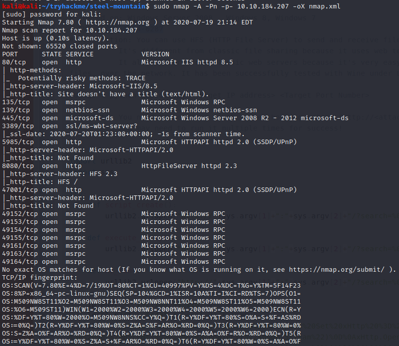

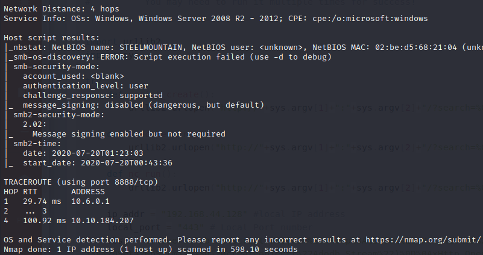

We see that Rejetto HTTP File Server 2.3 is running on the server. HttpFileServer 2.3 has a known remote code execution vulnerability. A public exploit is available at Exploit-DB (EDB 39161).

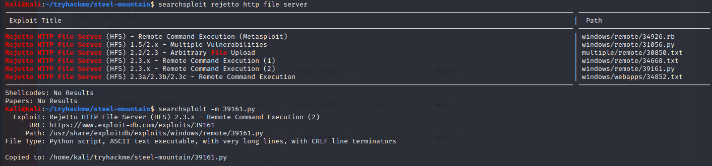

To prepare for the exploit, we need to modify the exploit script to use our local IP address. We also need to start our own web server hosting the binary nc.exe and start a netcat listener to catch the reverse shell.

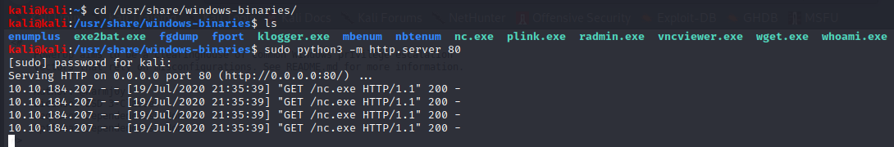

We run the exploit on our attacker machine with the command "python 39161.py \<victim ip\> 8080". We need to run this command twice; the first execution downloads nc.exe from our webserver to the victim server, and the second command uses the downloaded nc.exe to launch a reverse shell from the victim to our attacker machine.

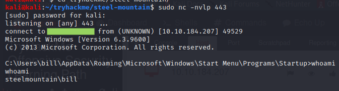

We gain a low-privilege shell as the local user bill. With this level of privilege, we can read bill's files stored on the server.

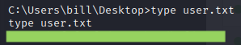

We now begin looking for ways to elevate our privileges. This process can be partially automated using the publicly available tool PowerUp.ps1.

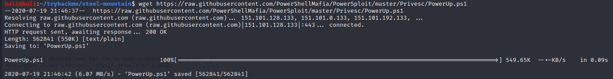

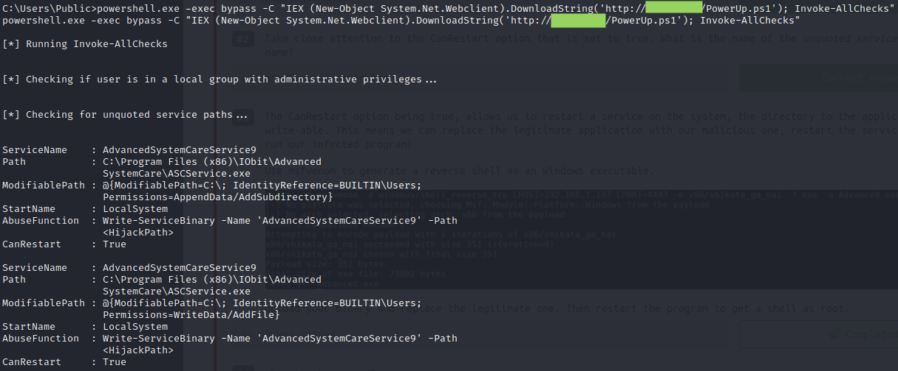

The tool finds a service AdvancedSystemCareService9 running with local system privileges. It has an unquoted service path containing a space. Bill has privileges to write into that service path and restart the service. This is a perfect target for privilege escalation.

We exploit this unqoted service path vulnerability by crafting a malicious binary called Advanced.exe.

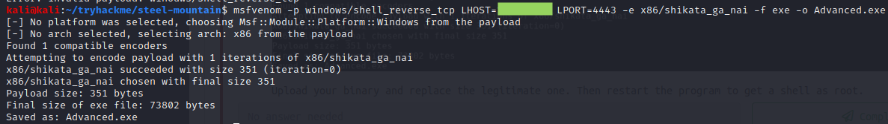

We download this binary onto the victim machine at C:\Program Files (x86)\IObit using Powershell. We restart the service in order to execute the malicious binary.

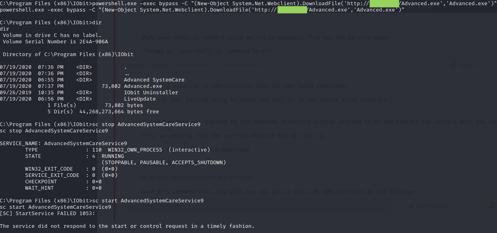

We catch the reverse shell on another waiting netcat listener on our attacker machine.

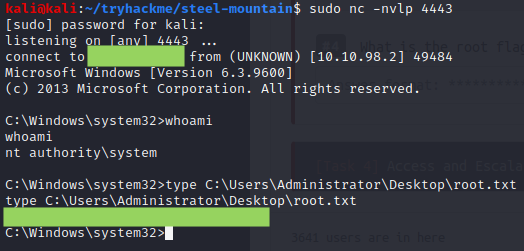

We now have full system priviliges on the victim host.