# VulnUniversity

## Summary

**Vulnerability Exploited:** File Upload from Untrusted Sources

**Vulnerability Explanation:** Visitors to the vulnuniversity website hosted at http://\<victim ip\>:3333 are able to access the internal web directory, where they may upload files to the server. Although the server disallows some file extensions, .phtml files may be uploaded. We were able to upload a malicious php script with the .phtml extension and execute it to gain low-privilege access to the server.

**Privilege Escalation Vulnerability:** The binary /bin/systemctl, which is used for managing services, runs with auto-elevated privileges This means any user can run systemctl with the highest possible privileges without using a password. We were able to create a malicious service and enable it with systemctl in order to gain root privileges.

**Vulnerability Fix:** To fix the file upload vulnerability, consider password-protecting the internal directory so that only authorized users may upload files. To fix the systemctl vulnerability, consider removing its auto-elevating privileges so that only authorized users with passwords may run systemctl with high privileges.

## Penetration

We begin with a full port scan of the target host using nmap. Nmap is a powerful port scanning tool with a scripting engine. The ability to run scripts makes nmap useful for vulnerability scanning and reconnaisance beyond just seeing what ports are open. Running Nmap with the flag _-A_ tells it to perform an _aggressive_ scan, which, among other things, will cause Nmap to perform OS detection, service version detection, and run some common scripts. The _-oX_ flag tells Nmap to save its output in an xml file. (The _-sV_ flag, which is redundant with _-A_ in this case, tells Nmap to perform version detection.)

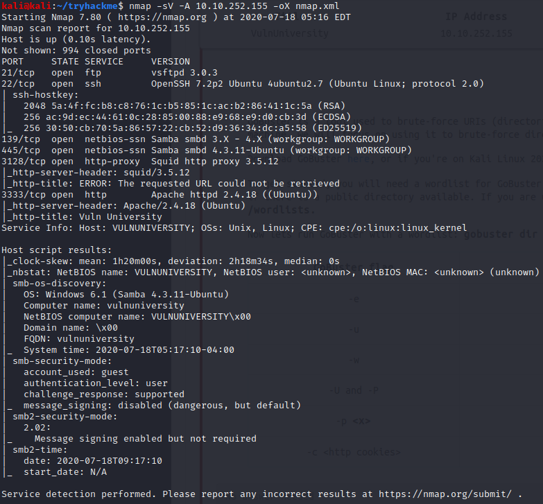

We decide to begin exploring the web server on port 3333, since these are typically soft targets.

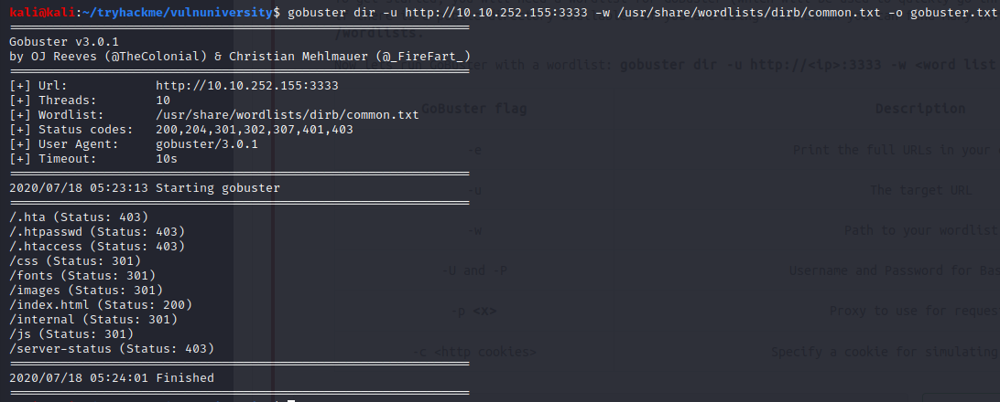

We use Gobuster to enumerate directories and files found on the server. Gobuster is a web content scanner useful for finding hidden directories and pages. We can often find insecure but sensitive content that only site administrators should see with this tool. the _dir_ option tells Gobuster to enumerate directories. The _-u_ flag sets the bas URI we want to target. The _-w_ flag selects a wordlist; in this case, we've used a wordlist of common web content from a similar web enumeration tool Dirb. The _-o_ flag saves Gobuster's output.

Gobuster finds two interesting directories: /js and /internal.

The /js directory lists all javascript running on the server and allows anyone to view the source code. This is a security vulnerability in the sense that it gives potential attackers too much visibility into what's running on the server and may make it easier to find and exploit javascript vulnerabilites.

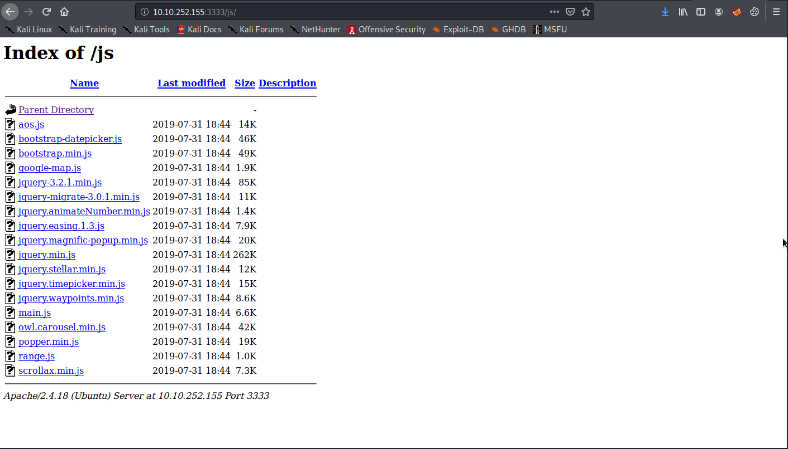

However, the /internal directory presents an even greater vulnerability, as visitors are allowed up upload files to the server without authentication.

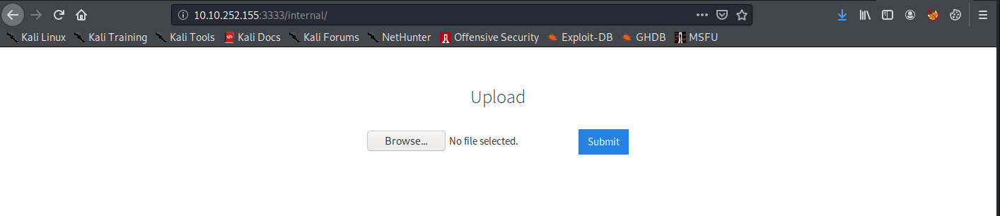

We quickly discover that not every file extension is allowed for upload. However, it is not difficult to find an extension that is both permissible and able to execute code on the server. We could do this manually by changing the file extension on our payload and trying to upload it through the web GUI, but it's more elegant to automate. We accomplish this by using Burp Suite Community's Intruder function, which allows us to automate HTTP requests. We simply automate the submission of a php webshell (Pentestmonkey's php-reverse-shell.php) with various extensions. (Burp Suite is a proxy tool with many useful features for pentesters; see https://portswigger.net/burp for more information.)

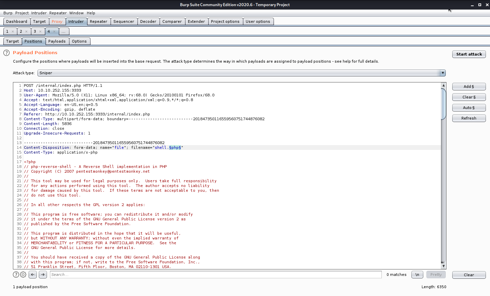

We find that the upload was sucessful with the .phtml extension.

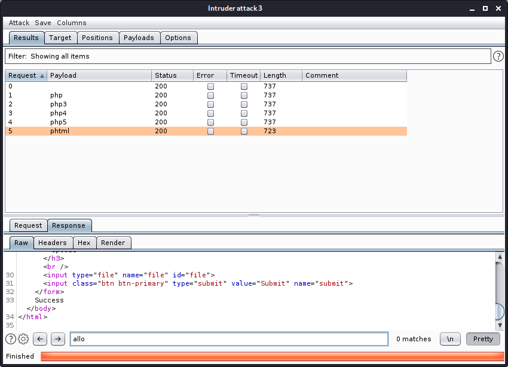

We start a netcat listener on our attacking machine and launch the shell by navigating to http://\<victim ip\>/internal/uploads/shell.phtml in a web browser. Netcat is a multi-purpose tool for making TCP or UDP connections, banner grabbing, listening on local ports, and more. The _-n_ flag tells netcat not to do DNS resolution. The _-v_ flag tells netcat to produce verbose output. Finally, _-lp 443_ tells netcat to _listen_ on _port_ 443.

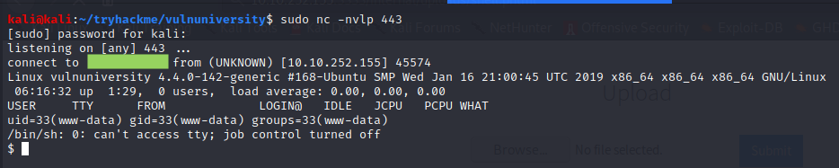

This earns us a low-privilege shell as www-data, the account that performs system actions on behalf of the web server. With this level of access, we are able to read files in the user Bill's home folder.

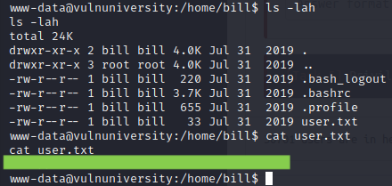

We begin looking for ways to elevate our privileges further, begining by listing auto-elevating binaries on the host.

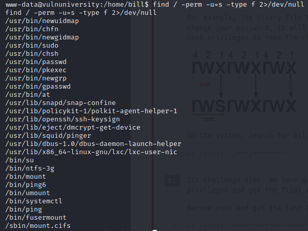

Having SUID enabled on /bin/systemctl is a known risk for privilege escalation. We are able to exploit this misconfiguration to gain root privileges, following a template from GTFOBins (https://gtfobins.github.io, a resource for linux privilege escalation) to launch a new reverse shell with socat, a tool similar to netcat.

We host the socat binary on our own web server and download it onto the victim with wget, a tool included on most linux systems for downloading web content. (Note that version of socat downloaded to the host is statically compiled. This makes the binary more likely to run as expected on different linux systems. The repository https://github.com/andrew-d/static-binaries has many useful static binaries for penetration testing.)

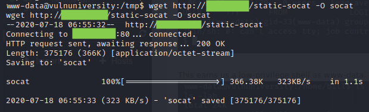

(Not pictured: "chmod +x socat")

To escalate our privileges using /bin/systemctl, we write a short script called "getroot.sh" that launches a socat reverse shell. We create a malicious service to run getroot.sh, and then link and enable the service with with systemctl to launch the shell.

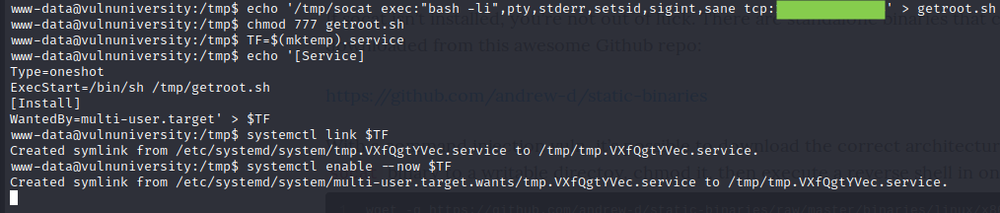

On our attacking machine, our waiting socat listener has caught the reverse shell.

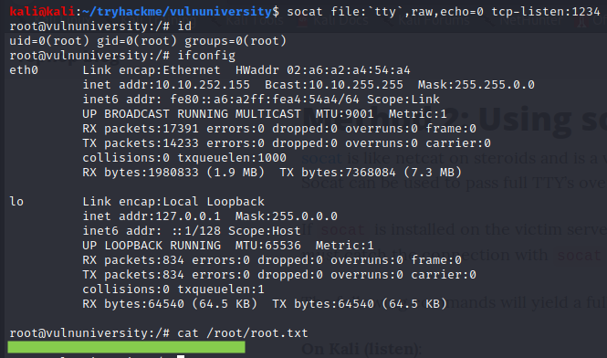

At this point, we have full administrative access to the host.